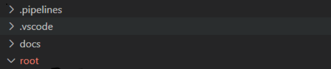

# AzOps Contribution Guide

- [Intended Audience](#Intended-Audience)
- [Overview](#Overview)
- [Dependency tool for local code modification](#Dependency-tool-for-local-code-modification)
- [Quick Start Repos](#Quick-Start-Repos)
- [How to modify/edit Code locally](#How-to-modifyedit-Code-locally)

### Overview

The purpose of this wiki is to provide you with a starting point for contribution towards the AzOps PowerShell Module. It provides sample files, folder structure and recommendations on how to get started with contributions. 


### Recommended tooling

* [Docker Desktop](https://docs.docker.com/desktop/)
* [Visual Studio Code](https://code.visualstudio.com/download)
* [Git](https://git-scm.com/downloads)
* [Install Remote - Containers on Visual Studio code](https://code.visualstudio.com/docs/remote/containers-tutorial)

### Quick Start Repos

Repo | Description
-|-
[AzOps](https://github.com/Azure/AzOps.git)|This repository is for active development of the AzOps PowerShell cmdlets.

 
### How to modify/edit Code locally

1. Clone repo locally 

```git
 git clone https://github.com/Azure/AzOps.git

Cloning into 'AzOps'...
remote: Enumerating objects: 1783, done.
remote: Counting objects: 100% (364/364), done.
remote: Compressing objects: 100% (226/226), done.
remote: Total 1783 (delta 276), reused 138 (delta 138), pack-reused 1419
Receiving objects: 100% (1783/1783), 1.60 MiB | 3.89 MiB/s, done.
Resolving deltas: 100% (1104/1104), done.

```

2. Open the code with VS Code


3. Reopen the code in container by clicking on icon below


It will open the local repo to docker container.

4. Connect and authenticate to Azure with the Azure PowerShell module 

```powershell
Connect-AzAccount -UseDeviceAuthentication
```

5. Then browse into below location: /workspaces/AzOps/scripts" and follow the steps mention in `Debug.ps1`.


6. Execute below command to setup the initial module environment.

```powershell
Import-Module ./src/AzOps.psd1 -Force
Initialize-AzOpsEnvironment
```
7. To test the Pull, use the below command 

```powershell
Invoke-AzOpsPull
```

> **_NOTE:_**  This will pull the existing state of the Azure Environment under `root` folder.



Below folder structure can be referenced as example:-

```bash
root
└── tenant root group (e42bc18f)
    ├── applications (73fded8a)
    │   ├── development (204bf7a2)
    │   │   ├── microsoft.authorization_roleassignments-4f687d42.json
    │   │   ├── microsoft.management_managementgroups-204bf7a2.json
    │   │   └── subscription-1 (fdfda291)
    │   │       ├── microsoft.authorization_policyassignments-securitycenterbuiltin.json
    │   │       └── microsoft.subscription_subscriptions-fdfda291.json
    │   ├── microsoft.authorization_roleassignments-219d3675.json
    │   ├── microsoft.management_managementgroups-73fded8a.json
    │   └── production (75718043)
    │       ├── microsoft.authorization_roleassignments-5bf6a637.json
    │       ├── microsoft.management_managementgroups-75718043.json
    │       └── subscription-2 (ad32efed)
    │           ├── microsoft.authorization_policyassignments-dataprotectionsecuritycenter.json
    │           ├── microsoft.authorization_policyassignments-securitycenterbuiltin.json
    │           └── microsoft.subscription_subscriptions-ad32efed.json
    ├── microsoft.authorization_roleassignments-d18adbf0.json
    ├── microsoft.authorization_roledefinitions-40db802e.json
    ├── microsoft.management_managementgroups-e42bc18f.json
    └── platform (4dc7bd90)
        ├── microsoft.authorization_policydefinitions-3029d7f6.parameters.json
        ├── microsoft.authorization_roleassignments-92ebbfe0.json
        ├── microsoft.management_managementgroups-4dc7bd90.json
        └── subscription-0 (1e045925)
            ├── microsoft.authorization_policyassignments-dataprotectionsecuritycenter.json
            ├── microsoft.authorization_policyassignments-securitycenterbuiltin.json
            ├── microsoft.authorization_roleassignments-3d8b69be.json
            ├── microsoft.subscription_subscriptions-1e045925.json
            └── networks
                └── microsoft.resources_resourcegroups-networks.json
```

