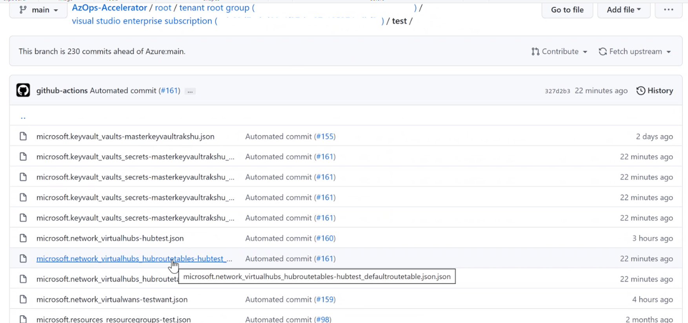

# AzOps Extended Child Resources Pull

- [Introduction](#Introduction)
- [Supported Action](#Supported-Action)
- [How to use](#How-to-use)

### Introduction

The purpose of this wiki is to provide detailed information about feature **AzOps: Extended Child Resources Pull**.

**AzOps: Extended Child Resources Pull** performs pull all the sub resources associated with a Azure resources.
For Example: Hub route table in Vitual WAN, Container from Azure storage account. 

### Supported Actions

- By setting the parameter to `FALSE` for option `Core.SkipExtendedChildResourcesDiscovery` in `settings.json` file will enable the pull. 

### How to use

AzOps has default feature to pull Azure resources and its immediate sub resources like Virtual machine and its network interface or Network security group and its Security Rules. However, its was not able to pull resources like Hub route table in Vitual WAN, Container from Azure storage account.

With this feature now it can pull all those sub resources under same resource group folder.

- Step 1 - Browse to `AzOps Accelerator` Repository after clone and locate file `settings.json`.

    

- Step 2 - Set the value to `FALSE` for `Core.SkipExtendedChildResourcesDiscovery` parameters.

- Step 3 - Trigger the pull to fetch the fresh data of existing Azure environment. Navigate to Actions and run `AzOps - Pull`

    
    
 
- Step 4 - Locate the Extended Child Resource file in the repository.

    

>NOTE:
Parameter SkipResourceGroup and SkipResource need to be set `FALSE` if parameter Extended Child resources need to be discovered. 