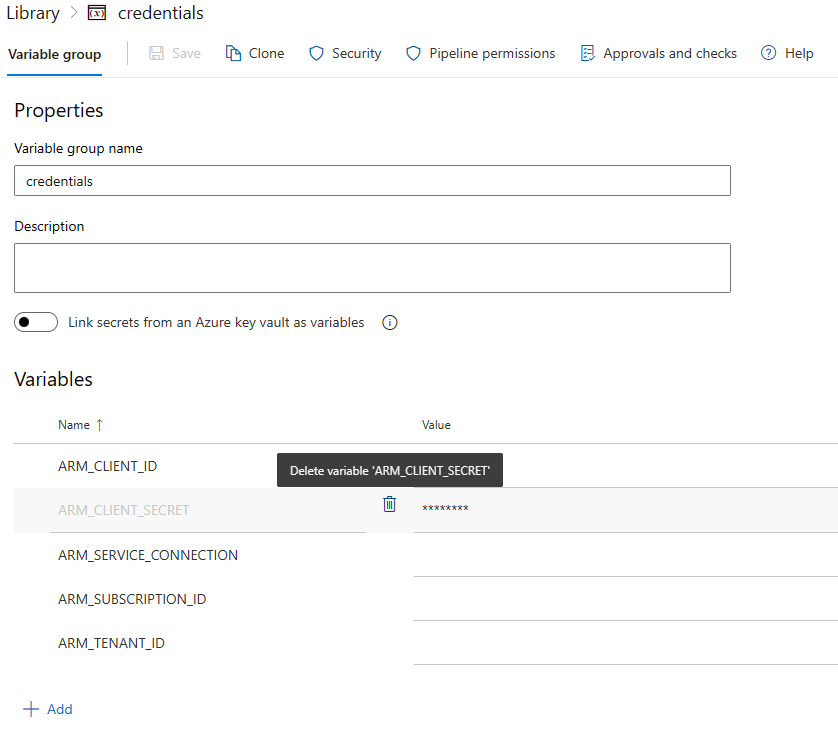

# Use Workload identity federation with the AzOps Azure Pipelines

- [Introduction](#introduction)
- [Configure](#configure)
- [Resources](#resources)

## Introduction

Azure Pipelines can use OpenID Connect (OIDC) for secure deployments to Azure, which uses short-lived tokens that are automatically rotated for each deployment.
In the context of AzOps, this means we can allow the AzOps pipeline Service Principal/User-assigned managed identity to access Azure Resource Manager and Azure AD with federated credentials, eliminating the need to create/handle secrets.

This wiki explains how this feature can be configured and used in the AzOps Azure Pipelines.

## Configure

Before you start to configure the workload federation feature in Azure AD and changing the Pipelines, ensure that you have followed the instructions at <https://github.com/azure/azops/wiki/prerequisites> and have your Service Principal/User-assigned managed identity ready with appropriate RBAC permissions.

How to setup Azure DevOps Pipelines with workload identity federation:

- [Connect to Microsoft Azure with an ARM service connection](https://learn.microsoft.com/en-us/azure/devops/pipelines/library/connect-to-azure?view=azure-devops)

- [Manually configure Azure Resource Manager workload identity service connections](https://learn.microsoft.com/en-us/azure/devops/pipelines/release/configure-workload-identity?view=azure-devops)

### Azure Pipelines
>
> **Note:** The starter Azure Pipelines in [AzOps-Accelerator](https://github.com/azure/azops-accelerator) have been updated to support federated credentials. If you haven't updated the pipelines recently, consider performing an update using the [update](https://github.com/azure/azops/wiki/updates) pipeline.

1. Validate that you have the latest version (post november 2023) of [templates/sharedSteps.yml](https://github.com/Azure/AzOps-Accelerator/blob/main/.pipelines/.templates/sharedSteps.yml) and [templates/vars.yml](https://github.com/Azure/AzOps-Accelerator/blob/main/.pipelines/.templates/vars.yml).

3. Remove the `ARM_CLIENT_SECRET` variable from the `credentials` variable group. If `ARM_CLIENT_SECRET` exists, the pipeline will try to connect with the secret instead.

    
4. Test the Pull, Push and Validate pipelines to ensure authentication works with federated credential.

## Resources

Read more about the functionality in the official docs below:

- [Azure AD Workload identity federation](https://learn.microsoft.com/en-us/azure/active-directory/develop/workload-identity-federation)
