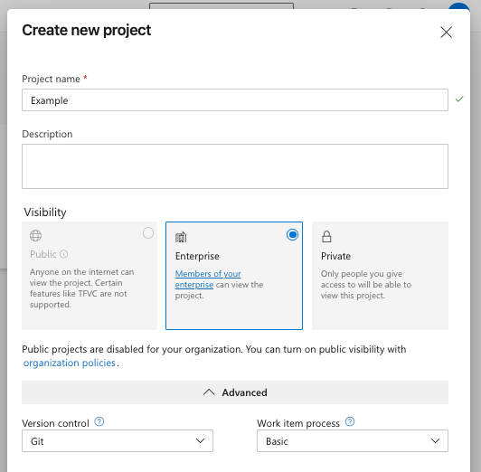
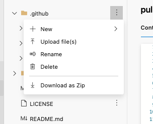
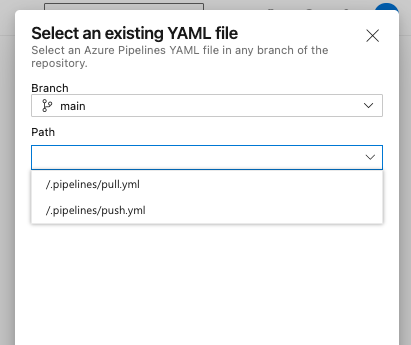
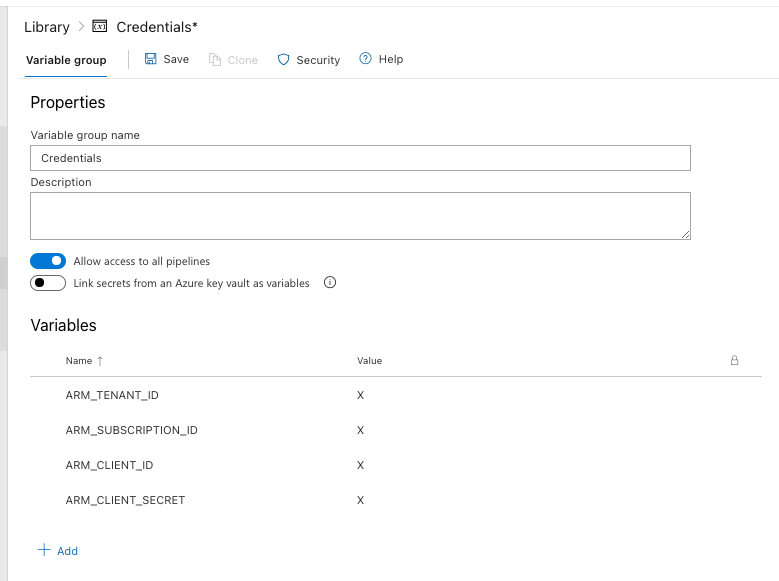
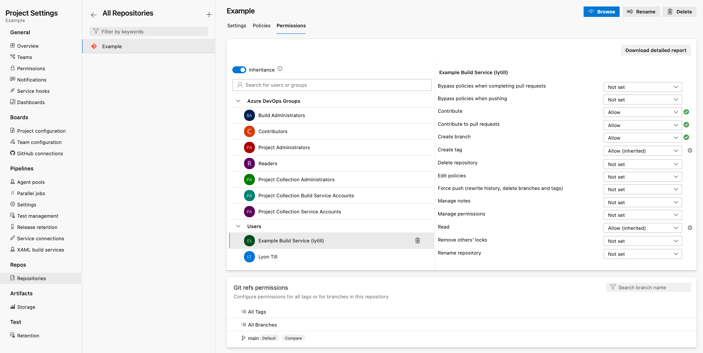
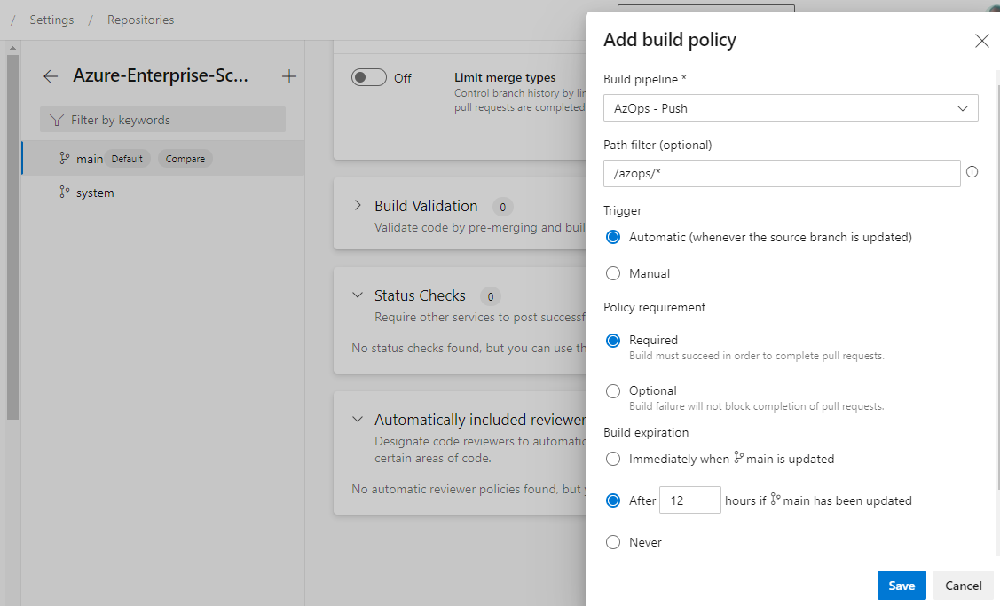
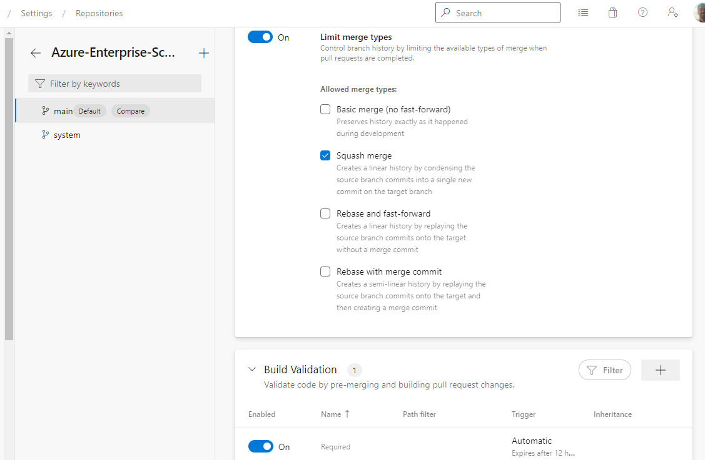

### In this guide

- [Portal](#portal)
  - [Create the project](#create-project)
  - [Import the repository](#import-repository)
  - [Remove actions directory](#remove-actions-directory)
  - [Configure the pipelines](#configure-pipelines)
  - [Configure the permissions](#configure-permissions)
  - [Configure the branch polices](#configure-branch-policies)
- [Scripts](#Scripts)
  - [Project](#project)
  - [Defaults](#defaults)
  - [Import](#import)
  - [Pipelines](#pipelines)
  - [Variables](#variables)

---

### Portal

#### Create project

Browse to [Azure DevOps](https://dev.azure.com), authenticate to the organisation and create a new _Private_ or _Enterprise_ project.

Ensure that the Version Control is selected with *Git*



#### Import repository

Within the newly created project, import the template repository from GitHub.

Provide the Clone URL of the AzOps Accelerator repository.


Additional documentation can be found [here](https://docs.microsoft.com/azure/devops/repos/git/import-git-repository).

#### Remove actions directory

As this deployment will be configured for Azure Pipelines it is safe to delete the `.github` folder.



#### Configure pipelines

Create two new pipelines, selecting the existing files:

- .pipelines/pull.yml
- .pipelines/push.yml

It's recommended to name these pipelines `AzOps - Pull` and `AzOps - Push` respectively (in both the YAML file, *and* within the pipeline after you create it).



After creating the pipelines, create a new Variable Group by navigating to `Library`.

Set the name of Variable Groups to `Credentials`. This can be altered but the value in the pipelines will need to be updated.

Add the variables from the Service Principal creation.

- ARM_TENANT_ID
- ARM_SUBSCRIPTION_ID
- ARM_CLIENT_ID
- ARM_CLIENT_SECRET



Change the variable type for `ARM_CLIENT_SECRET` to secret.

These variables will used to authenticate the pipelines with Azure.

#### Configure permissions

The build service account must have the following permissions on the repository:

- `Contribute`
- `Contribute to pull requests`
- `Create branch`

Navigate to the project settings, within the *Repos* section, select *Repositories*, select the newly created repository.

Select the *[Project] Build Service ([Organization])* account, and configure the permissions above.



#### Configure branch policies

In order for the `AzOps - Push` pipeline to run, set the repository `main` branch to [require build verification](https://docs.microsoft.com/azure/devops/repos/git/branch-policies) using most of default settings, but do define a path filter `/azops/*`.



It is also recommend to allow only `squash` merge types from branches into `main`.



---

### Scripts

The following commands require the [Azure CLI](https://docs.microsoft.com/en-us/cli/azure/) and the [DevOps Extension](https://docs.microsoft.com/en-us/azure/devops/cli/?view=azure-devops).

> Before running the following commands, the '(replace)' values need to be updated.  
> Manual step required is to add the permissions within the UI on the repository for the build service.

#### Project

Create the new project within a specific organization

```bash
az devops project create \
    --name '(replace)' --organization '(replace)'
```

#### Defaults

Set the defaults for the local Azure Cli shell

```bash
az devops configure \
    --defaults organization=https://dev.azure.com/'(replace)' project='(replace)'
```

#### Import 

Create a new repository from the upstream template repository

```bash
az repos import create \
    --git-url https://github.com/azure/azops.git --repository '(replace)'
```

#### Pipelines 

Create two new pipelines from existing YAML manifests

```bash
az pipelines create \
    --name 'AzOps - Pull' --branch main --repository '(replace)' --repository-type tfsgit --yaml-path .pipelines/pull.yml

az pipelines create \
    --name 'AzOps - Push' --branch main --repository '(replace)' --repository-type tfsgit --yaml-path .pipelines/push.yml
```

#### Variables

Add secrets for authenticating pipelines with Azure Resource Manager

```bash
az pipelines variable create \
    --name 'ARM_TENANT_ID' --pipeline-name 'AzOps - Pull' --secret false --value '(replace)'

az pipelines variable create \
    --name 'ARM_SUBSCRIPTION_ID' --pipeline-name 'AzOps - Pull' --secret false --value '(replace)'

az pipelines variable create \
    --name 'ARM_CLIENT_ID' --pipeline-name 'AzOps - Pull' --secret false --value '(replace)'

az pipelines variable create \
    --name 'ARM_CLIENT_SECRET' --pipeline-name 'AzOps - Pull' --secret true --value '(replace)'

az pipelines variable create \
    --name 'ARM_TENANT_ID' --pipeline-name 'AzOps - Push' --secret false --value '(replace)'

az pipelines variable create \
    --name 'ARM_SUBSCRIPTION_ID' --pipeline-name 'AzOps - Push' --secret false --value '(replace)'

az pipelines variable create \
    --name 'ARM_CLIENT_ID' --pipeline-name 'AzOps - Push' --secret false --value '(replace)'

az pipelines variable create \
    --name 'ARM_CLIENT_SECRET' --pipeline-name 'AzOps - Push' --secret true --value '(replace)'
```

#### Policy

Add build validation policy to push changes

```bash
az pipelines show \
    --name 'AzOps - Push'

az repos policy build create \
    --blocking true \
    --branch main \
    --display-name 'Push' \
    --enabled true \
    --build-definition-id (replace) \
    --repository-id (replace) \
    --queue-on-source-update-only false \
    --manual-queue-only false \
    --valid-duration 0
```

