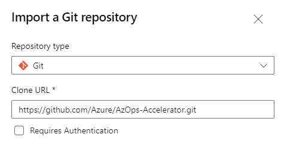

# AzOps Via Azure Pipelines

- [Prerequisites](#Prerequisites)
- [Powershell command to create SPN](#Powershell-command-to-create-SPN)
- [Powershell command to assign the Directory role permissions](#Powershell-command-to-assign-the-Directory-role-permissions)
- [Important Repo Link to refer](#Important-Repo-Link-to-refer)
- [Two ways to configure AzOps](#Two-ways-to-configure-AzOps)
- [Configure AzOps via Azure DevOps Portal](#Configure-AzOps-via-Azure-DevOps-Portal)
- [Configure via command line script](#Configure-via-command-line-script)


## Prerequisites

* [Create the Service Principal](https://docs.microsoft.com/en-us/azure/active-directory/develop/howto-create-service-principal-portal)

* [Assign the permissions at the required scope (/)](https://docs.microsoft.com/en-us/azure/active-directory/develop/howto-create-service-principal-portal)
* Assign the Directory role permissions

* [Create project](https://docs.microsoft.com/en-us/azure/devops/organizations/projects/create-project?view=azure-devops&tabs=preview-page)

Please check if the Az and AzureAD modules are installed locally before executing these scripts. Alternatively, these command can be run within a Cloud Shell instance.

### Powershell command to create SPN:
```powershell
Connect-AzAccount
$servicePrincipal = New-AzADServicePrincipal -Role Owner -Scope / -DisplayName AzOps
Write-Host "ARM_TENANT_ID: $((Get-AzContext).Tenant.Id)"
Write-Host "ARM_SUBSCRIPTION_ID: $((Get-AzContext).Subscription.Id)"
Write-Host "ARM_CLIENT_ID: $($servicePrincipal.ApplicationId)"
Write-Host "ARM_CLIENT_SECRET: $($servicePrincipal.Secret | ConvertFrom-SecureString -AsPlainText)"
```
### Powershell command to assign the Directory role permissions

```powershell
Install-Module -Name AzureAD
Connect-AzureAD
$servicePrincipal = Get-AzureADServicePrincipal -Filter "DisplayName eq 'AzOps'"
$directoryRole = Get-AzureADDirectoryRole -Filter "DisplayName eq 'Directory Readers'"
if ($directoryRole -eq $null) {
    Write-Warning "Directory Reader role not found"
}
else {
    Add-AzureADDirectoryRoleMember -ObjectId $directoryRole.ObjectId -RefObjectId $servicePrincipal.ObjectId
}
```

### Important Repo Link to refer 

Repo | Description
-|-
[AzOps Accelerator](https://github.com/Azure/AzOps-Accelerator.git) | This template repository is for getting started with the AzOps integrated CI/CD solution.


### Two ways to configure AzOps
- via Azure DevOps Portal
- Via command line script

### Configure AzOps via Azure DevOps Portal

- Import the above [Repo](https://github.com/Azure/AzOps-Accelerator.git) to new project.
    
    1. Select Repos, Files.
        
        
    
    2. From the repo drop-down, select Import repository.

        
    
    3. Provide the Clone URL of the AzOps Accelerator repository.

        

    4. Below Repo will be imported.

        

- Remove actions directory: As this deployment will be configured for Azure Pipelines it is safe to delete the `.github` folder.

    
 
 - Configure pipelines: Create two new pipelines, selecting the existing files
    * pipelines/pull.yml
    * pipelines/push.yml
- Steps to create YML Pipeline.
    1. Navigate to the pipeline and click on new Pipeline.
    
    
    2. Select the below Azure repo option.
    
    
    
    3. Create two new pipelines, selecting the existing files
    
      

- Rename the Pipeline `AzOps - Pull` and `AzOps - Push` respectively (in both the YAML file, and within the pipeline after you create it).
  

-  create a service principle in Azure which will further be used for deployment via AzOps.
    1. Sign in to your Azure Account through the Azure portal.

    2. Select Azure Active Directory.

    3. Select App registrations.

    4. Name the application. Select a supported account type, which determines who can use the application.
      

-  Assign a role to the SPN
    1. In the Azure portal, select the level of scope you wish to assign the application to. For example, to assign a role at the subscription scope, search for and select Subscriptions, or select Subscriptions on the Home page.
    

    2. Select the particular subscription to assign the application to.
     
If you don't see the subscription you're looking for, select global subscriptions filter. Make sure the subscription you want is selected for the portal.

    3. Select Access control (IAM).

    4. Select Select Add > Add role assignment to open the Add role assignment page.

    5. Select the role you wish to assign to the application. For example, to allow the application to execute actions like reboot, start and stop instances, select the Contributor role.

    > Note: If this SPN is require to be used for assigning RBAC, then Owner access.

- create a new Variable Group by navigating to `Library`
- Set the name of Variable Groups to Credentials. This can be altered but the value in the pipelines will need to be updated.
- Add the variables from the Service Principal creation.

        ARM_TENANT_ID
        ARM_SUBSCRIPTION_ID
        ARM_CLIENT_ID
        ARM_CLIENT_SECRET

>Note: Change the variable type for ARM_CLIENT_SECRET to secret.

 
    
- Update creadential with details captured while creating the SPN. These variables will used to authenticate the pipelines with Azure.
- The build service account must have the following permissions on the repository.
    * Contribute
    * Contribute to pull requests
    * Create branch

- Navigate to the project settings, within the Repos section, select Repositories, select the newly created repository.

- Select the [Project] Build Service ([Organization]) account, and configure the permissions above.

      

- Configure branch policies: In order for the AzOps - Push pipeline to run, set the repository main branch to require build verification using most of default settings, but do define a path filter /azops/*.
      
- Allow only squash merge types from branches into main.

     

- All the configuration values can be modified within the `settings.json` file to change the default behavior of AzOps.      

    Id|Name|Description|Example
    -|-|-|-
    01|AutoGeneratedTemplateFolderPath|Generates the Folder within the `root` folder to keep all the standalone json file like Policy , Subscription detail etc.("Core.AutoGeneratedTemplateFolderPath": "/.az")|
    02|DefaultDeploymentRegion|This switch will to be used to set the default region for deployments|`"Core.DefaultDeploymentRegion": "northeurope"`
    03|EnrollmentAccountPrincipalName| Switch will be used to set the default enrollment account in case of Subscription creation|`"Core.EnrollmentAccountPrincipalName": ""`|
    04|ExcludedSubOffer|This switch excludes speicific Subscription offer types from getting pulled |`"Core.ExcludedSubOffer": [ "AzurePass_2014-09-01","FreeTrial_2014-09-01","AAD_2015-09-01"]`|
    05|ExcludedSubState|This switch excludes  specific states of Subscription from getting pulled |`"Core.ExcludedSubState": ["Disabled","Deleted","Warned","Expired"]`|
    06|IgnoreContextCheck|This switch skip Azure PowerShell context validation, if it set to true|`"Core.IgnoreContextCheck": false`
    11|OfferType|Set the default offer type for Subscriptions for pull|`"Core.OfferType": "MS-AZR-0017P"`
    07|PartialMgDiscoveryRoot| This switch will generate seperate folder hierachy for specific Management Groups if mentioned|`"Core.PartialMgDiscoveryRoot": []"`
    08|SkipPolicy| If this set to `True`, then it will avoid creating/pulling Azure Policy state of the environment in json file|`"Core.SkipPolicy": false`
    09|SkipResource|If this set to `True`, then it will avoid creating/pulling Azure resources within the resources group information in json file|`"Core.SkipResource": false`
    10|SkipResourceGroup|If this set to `false`, then it will generate folder hierachy for all Resource Groups in the Azure infra|`"Core.SkipResourceGroup": false`
    11|SkipRole|If this set to `false`, then it will generate file for RBAC information in the Azure infra|`"Core.SkipRole": false`
    12|State|It generate default top level folder in the repository with the name defined in the setting file|
    13|SubscriptionsToIncludeResourceGroups|If `*` is mentioned then, it will generate folder hierachy for all Resource Groups, else specific resource group can be mentioned |`"Core.SubscriptionsToIncludeResourceGroups": "*"`
    14|TemplateParameterFileSuffix|Its generated the template file with specific file suffix|`"Core.TemplateParameterFileSuffix": ".json"`

- Now, we are good to trigger the first push, which will in turn trigger the first pull to fetch the existing Azure environment.
  

- Once, pull pipeline complete it will look like below screenshot.

- This `root` folder contains existing state of Azure environment.
- Now, start creating arm template to deployment more resources as shown in below screen shot.


> Note: Please follow above naming convention for parameter file creation.

- Run the Push pipeline to apply the update.
  

### Configure via command line script

- Install dependent tools & extentions.
    - [Azure CLI](https://docs.microsoft.com/en-us/cli/azure/)
    - [DevOps Extension.](https://docs.microsoft.com/en-us/azure/devops/cli/?view=azure-devops)
- Step to add the permissions within the UI on the repository for the build service.
    1. Open Project settings>Repositories.To set the permissions for all Git repositories, choose Security.
    

    2. Now set the permission for build service as shown below.
    
- Before running the following commands, values need to be updated in `<xx>`.
- Create the new project within a specific organization
```git
az devops project create \
    --name '<Name_of_Project>' --organization '<Name_Of_organization>'
```
- Set the defaults for the local Azure Cli shell

```git
az devops configure \
    --defaults organization=https://dev.azure.com/'<Name_Of_organization>' project='<Name_of_Project>'
```
- Create a new repository from the [AzOps Accelerator](https://github.com/Azure/AzOps-Accelerator.git) template repository
```git
az repos import create \
    --git-url https://github.com/Azure/AzOps-Accelerator.git --repository '<Name_Of_repository>'
```
- Create two new pipelines from existing YAML manifests
```git
az pipelines create \
    --name 'AzOps - Pull' --branch main --repository '<Name_Of_repository>'--repository-type tfsgit --yaml-path .pipelines/pull.yml

az pipelines create \
    --name 'AzOps - Push' --branch main --repository '<Name_Of_repository>'--repository-type tfsgit --yaml-path .pipelines/push.yml
```
- Add secrets for authenticating pipelines with Azure Resource Manager

```git
az pipelines variable create \
    --name 'ARM_TENANT_ID' --pipeline-name 'AzOps - Pull' --secret false --value '<Value>'

az pipelines variable create \
    --name 'ARM_SUBSCRIPTION_ID' --pipeline-name 'AzOps - Pull' --secret false --value '<Value>'

az pipelines variable create \
    --name 'ARM_CLIENT_ID' --pipeline-name 'AzOps - Pull' --secret false --value '<Value>'

az pipelines variable create \
    --name 'ARM_CLIENT_SECRET' --pipeline-name 'AzOps - Pull' --secret true --value '<Value>'

az pipelines variable create \
    --name 'ARM_TENANT_ID' --pipeline-name 'AzOps - Push' --secret false --value '<Value>'

az pipelines variable create \
    --name 'ARM_SUBSCRIPTION_ID' --pipeline-name 'AzOps - Push' --secret false --value '<Value>'

az pipelines variable create \
    --name 'ARM_CLIENT_ID' --pipeline-name 'AzOps - Push' --secret false --value '<Value>'

az pipelines variable create \
    --name 'ARM_CLIENT_SECRET' --pipeline-name 'AzOps - Push' --secret true --value '<Value>'
```
- Add build validation policy to push changes

```git
az pipelines show \
    --name 'AzOps - Push'

az repos policy build create \
    --blocking true \
    --branch main \
    --display-name 'Push' \
    --enabled true \
    --build-definition-id <builddefinitionid> \
    --repository-id <repository-id> \
    --queue-on-source-update-only false \
    --manual-queue-only false \
    --valid-duration 0

```

    


