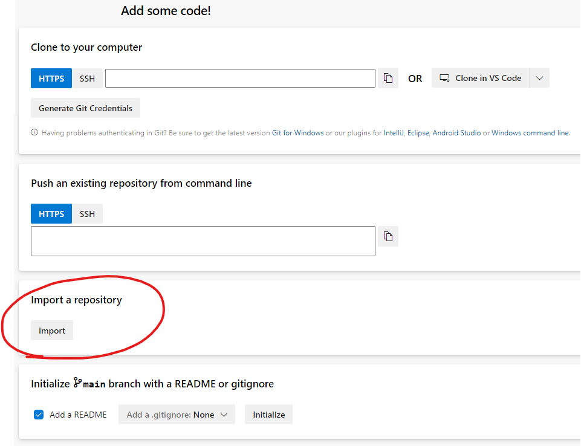
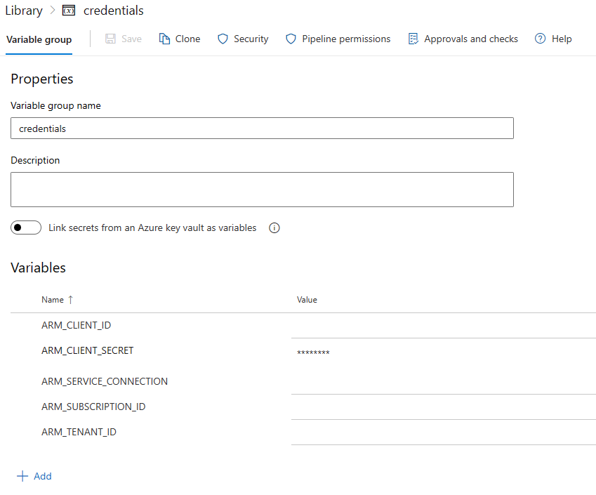
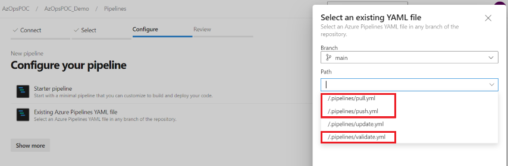

# AzOps via Azure Pipelines

- [Prerequisites](#prerequisites)
  - [Further reading](#further-reading)
  - [Important Repository Link to refer](#important-repository-link-to-refer)
- [Configure AzOps using Azure CLI in PowerShell](#configure-azops-using-azure-cli-in-powershell)
- [Configure AzOps via Azure DevOps Portal](#configure-azops-via-azure-devops-portal)
- [Configuration, clean up and triggering the pipelines](#configuration-clean-up-and-triggering-the-pipelines)

## Prerequisites

Before you start, make sure you have followed the steps in the [prerequisites](https://github.com/azure/azops/wiki/prerequisites) article to configure the required permissions for AzOps.

### Further reading

Links to documentation for further reading:

- [Create the Service Principal](https://learn.microsoft.com/azure/active-directory/develop/howto-create-service-principal-portal)
- [Assign the permissions at the required scope (/)](https://learn.microsoft.com/azure/active-directory/develop/howto-create-service-principal-portal)
- [Assign the Directory role permissions](https://learn.microsoft.com/azure/active-directory/roles/manage-roles-portal)
- [Create Azure DevOps project](https://learn.microsoft.com/azure/devops/organizations/projects/create-project?view=azure-devops&tabs=preview-page)

### Important Repository link to refer

| Repository                                                            | Description                                                                               |
| ------------------------------------------------------------------- | ----------------------------------------------------------------------------------------- |
| [AzOps Accelerator](https://github.com/Azure/AzOps-Accelerator.git) | This template repository is for getting started with the AzOps integrated CI/CD solution. |

## Configure AzOps using Azure CLI in PowerShell

The PowerShell script below will set up a new project or use an existing if it already exists. The account used to sign in with Azure CLI need to have access to create projects in Azure DevOps or have the owner role assigned to an existing project.

- The script will:
  - Create a new repository and import the official [AzOps Accelerator](https://github.com/Azure/AzOps-Accelerator.git) repository
  - Add a variable group called `credentials`
  - Create pipelines for `Push`, `Pull` and `Validate`
  - Add a build validation policy to the main branch triggering the Validate pipeline on Pull Requests
  - Add a branch policy to limit merge types to squash only
  - Assign permissions to the built-in Build Service account to contribute, open Pull Requests and bypass policies when completing pull requests (to bypass validation pipeline and any approval checks)
  - Assign pipeline permissions for the variable group to each of the pipelines

<br/>

- Install dependent tools & extensions
  - [Azure CLI](https://learn.microsoft.com/cli/azure/)
  - [DevOps Extension](https://learn.microsoft.com/azure/devops/cli/?view=azure-devops)

<br/>

- Sign in to Azure CLI with an account that has access to create projects in Azure DevOps or have the owner role assigned to an existing project
  - `az login`

<br/>

- Before running the commands below, any `<Value>` needs to be replaced with your values

> If you are running self-hosted build agents in Azure with Managed Identity enabled set the value for `$ARM_CLIENT_ID` and `$ARM_CLIENT_SECRET` to `''`.

```PowerShell
# Configuration, make sure to replace <Value> with your values
$Organization = '<Value>'
$ProjectName = '<Value>'
$RepoName = '<Value>'
$TenantId = '<Value>'
$SubscriptionId = '<Value>'
$ARM_CLIENT_ID = '<Value>'
$ARM_CLIENT_SECRET = '<Value>'

$OrgParams = @{
    Organization = $Organization
    Project      = $ProjectName
}

# Install the ADOPS PowerShell module
Install-Module -Name ADOPS -Scope CurrentUser -RequiredVersion '2.0.0' -Force

# Connect to Azure DevOps (This will open a browser window for you to login)
Connect-ADOPS -Organization $Organization

# Create a new project and wait for it to be created
$Project = Get-ADOPSProject @OrgParams
if ($null -eq $Project) {
    $Request = New-ADOPSProject -Name $ProjectName -Organization $Organization -Visibility Private
    $Count = 0
    do {
        Start-Sleep -Seconds 1
        $Count++
        $Result = Invoke-ADOPSRestMethod -Uri $Request.Url
        if ($Count -gt 30) {
            throw "Project creation timed out"
        }
    } while ($Result.status -ne 'succeeded')
    $Project = Get-ADOPSProject @OrgParams
}

# Create a new repository from the AzOps Accelerator template repository
try {
    $Repo = Get-ADOPSRepository @OrgParams -Repository $RepoName
}
catch {
    $Repo = New-ADOPSRepository @OrgParams -Name $RepoName
}

# Import the AzOps Accelerator template repository and wait for the import to complete
$ImportRequest = Import-ADOPSRepository @OrgParams -RepositoryName $RepoName -GitSource 'https://github.com/Azure/AzOps-Accelerator.git'
$Count = 0
do {
    Start-Sleep -Seconds 1
    $Count++
    $Result = Invoke-ADOPSRestMethod -Uri $ImportRequest.Url
    if ($Count -gt 30) {
        throw "Repository import task timed out"
    }
} while ($Result.status -ne 'completed')
$null = Set-ADOPSRepository -RepositoryId $repo.id -DefaultBranch 'main' @OrgParams

# Add a variable group for authenticating pipelines with Azure Resource Manager and record the id output
$CredentialVariableGroup = @(
    @{Name = 'ARM_TENANT_ID'; Value = $TenantId; IsSecret = $false }
    @{Name = 'ARM_SUBSCRIPTION_ID'; Value = $SubscriptionId; IsSecret = $false }
    @{Name = 'ARM_CLIENT_ID'; Value = $ARM_CLIENT_ID; IsSecret = $false }
)
if ($ARM_CLIENT_SECRET) {
    $CredentialVariableGroup += @{Name = 'ARM_CLIENT_SECRET'; Value = $ARM_CLIENT_SECRET; IsSecret = $true }
}
$null = New-ADOPSVariableGroup -VariableGroupName 'credentials' -VariableHashtable $CredentialVariableGroup @OrgParams

$ConfigVariableGroup = @(
    @{Name = 'AZOPS_MODULE_VERSION'; Value = ''; IsSecret = $false }
    @{Name = 'AZOPS_CUSTOM_SORT_ORDER'; Value = 'false'; IsSecret = $false }
)
$null = New-ADOPSVariableGroup -VariableGroupName 'azops' -VariableHashtable $ConfigVariableGroup @OrgParams

# Create three new pipelines from existing YAML manifests.
$null = New-ADOPSPipeline -Name 'AzOps - Push'     -YamlPath '.pipelines/push.yml'     -Repository $RepoName @OrgParams
$null = New-ADOPSPipeline -Name 'AzOps - Pull'     -YamlPath '.pipelines/pull.yml'     -Repository $RepoName @OrgParams
$null = New-ADOPSPipeline -Name 'AzOps - Validate' -YamlPath '.pipelines/validate.yml' -Repository $RepoName @OrgParams

# Add build validation policy to validate pull requests
$RepoId = Get-ADOPSRepository -Repository $RepoName @OrgParams | Select-Object -ExpandProperty Id
$PipelineId = Get-ADOPSPipeline -Name 'AzOps - Validate' @OrgParams | Select-Object -ExpandProperty Id
$BuildPolicyParam = @{
    RepositoryId     = $RepoId
    Branch           = 'main'
    PipelineId       = $PipelineId
    Displayname      = 'Validate'
    filenamePatterns = '/root/*'
}
$null = New-ADOPSBuildPolicy @BuildPolicyParam @OrgParams

# Add branch policy to limit merge types to squash only
$null = New-ADOPSMergePolicy -RepositoryId $RepoId -Branch 'main' -allowSquash @OrgParams

# Add permissions for the Build Service account to the git repository
$ProjectId = Get-ADOPSProject @OrgParams | Select-Object -ExpandProperty Id
$BuildAccount = Get-ADOPSUser -Organization $Organization |
    Where-Object displayName -eq "$ProjectName Build Service ($Organization)"
foreach ($permission in 'GenericContribute', 'ForcePush', 'CreateBranch', 'PullRequestContribute', 'PullRequestBypassPolicy') {
    $null = Set-ADOPSGitPermission -ProjectId $ProjectId -RepositoryId $RepoId -Descriptor $BuildAccount.descriptor -Allow $permission
}

# Add pipeline permissions for all three pipelines to the credentials Variable Groups
$Uri = "https://dev.azure.com/$Organization/$ProjectName/_apis/distributedtask/variablegroups?api-version=7.1-preview.2"
$VariableGroups = (Invoke-ADOPSRestMethod -Uri $Uri -Method 'Get').value | Where-Object name -in 'credentials', 'azops'
foreach ($pipeline in 'AzOps - Push', 'AzOps - Pull', 'AzOps - Validate') {
    $PipelineId = Get-ADOPSPipeline -Name $pipeline @OrgParams | Select-Object -ExpandProperty Id
    foreach ($groupId in $VariableGroups.id) {
        $null = Grant-ADOPSPipelinePermission -PipelineId $PipelineId -ResourceType 'VariableGroup' -ResourceId $groupId @OrgParams
    }
}
```

- Your new Project is now ready. Skip down to [Configuration, clean up and triggering the pipelines](#configuration-clean-up-and-triggering-the-pipelines) to get started.

## Configure AzOps via Azure DevOps Portal

- Import the above [AzOps-Accelerator repository](https://github.com/Azure/AzOps-Accelerator.git) to new project.

    1. `Repos` and then `Files`.

        

    1. Select Import.

        

    1. Provide the Clone URL of the AzOps Accelerator repository and import:
        <https://github.com/Azure/AzOps-Accelerator.git>

        

    1. Set default branch. Go to `Repos` and then `Branches` select `main` and `Set as default branch`

        

    1. Once done it looks something like this (on `main` branch).

        

- Create two new Variable groups by navigating to `Pipelines` then `Library`

  

  - Set the first `Variable group name` to `credentials`. This can be altered but the value in the
    `.pipelines\.templates\vars.yml` then need to be updated as well.

  - Add the variables from the `Service Principal` creation to the `credentials Variable group`.

    > If you are running self-hosted build agents in Azure with Managed Identity enabled set the value for `ARM_CLIENT_ID` and `ARM_CLIENT_SECRET` to `null`.

    ```shell
    ARM_CLIENT_ID
    ARM_CLIENT_SECRET
    ARM_SUBSCRIPTION_ID
    ARM_TENANT_ID
    ```

    > Note: Change the variable type for ARM_CLIENT_SECRET to secret.

    

  - Set the second `Variable group name` to `azops`. This can be altered but the value in the
    `.pipelines\.templates\vars.yml` then need to be updated as well.

    ```shell
    AZOPS_CUSTOM_SORT_ORDER
    AZOPS_MODULE_VERSION
    ```

    > Note: Set the variable `AZOPS_CUSTOM_SORT_ORDER` value to `false`.

    

- Configure pipelines: Create three new pipelines (without running them), selecting the existing files in the following order:
  > Note: Make sure to create the pipelines in the correct order, otherwise the pull pipeline will not be triggered by the push pipeline.
  - \.pipelines/push.yml
  - \.pipelines/pull.yml
  - \.pipelines/validate.yml

  > Note: It is advised to set `Pipeline permissions` with `Restrict permission` and only allow each pipeline access to each `Variable group`.


<br/>

**Steps to create pipelines:**

1. Navigate to `Pipelines` and click on `Create pipeline`.

    

1. Select the `Azure Repos Git` option and choose `Existing Azure Pipelines YAML file`.

    

    

1. Create new pipelines, selecting the existing files

    

- Rename the Pipelines to `AzOps - Push`, `AzOps - Pull` and `AzOps - Validate` respectively
  (in both the YAML file, and within the pipeline after you create it).

  

- Assign permissions to build service account at repository scope.
  The build service account must have the following permissions on the repository.
  - **Contribute**
  - **Contribute to pull requests**
  - **Create branch**
  - **Force push**

  When using branch policies, also add the build service permission to
  **Bypass policies when completing pull requests** to be able to merge automated pull requests.

  1. Navigate to the project settings, within the Repos section, select Repositories, select the newly created
  repository.

  1. Select the [Project] Build Service ([Organization]) account, and configure the permissions above.

     

- Configure branch policies
  In order for the `AzOps - Validate` pipeline to run, set the repository main
  branch to require build verification using most of default settings, but do define a path filter matching
  your state setting, for example: `/root/*`.
  

- Allow only squash merge types from branches into main.

     

## Configuration, clean up and triggering the pipelines

- Configuration values can be modified within the `settings.json` file to change the default behavior of AzOps. The settings are documented in [Settings chapter](https://github.com/azure/azops/wiki/settings)

- Optionally, add the variable `AZOPS_MODULE_VERSION` to the `Variable group` `azops` to pin the version of the AzOps module to be used

- This deployment is configured for Azure Pipelines. It is safe to
  delete the `.github` folder and any Markdown files in the root of the repository

    

- Now, we are good to trigger the first push, which will in turn trigger the first pull to fetch the existing
  Azure environment
  

- Once pull pipeline completes it will look like the screenshot below

  

- This `root` folder contains existing state of Azure environment

- Now, start creating arm templates to deploy more resources as shown in screenshot below

  
   > Note: Please follow above naming convention for parameter file creation.

- Creating a Pull Request with changes to the `root` folder will trigger a validate pipeline. The validate pipeline will perform a What-If deployment of the changes and post the results as a comment om the pull request

- Merge the Pull Request to trigger the push pipeline and deploy the changes

  
