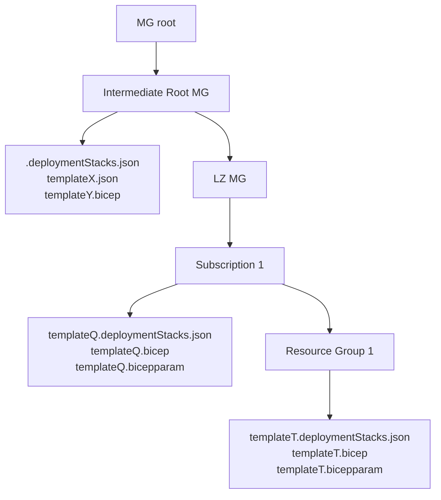
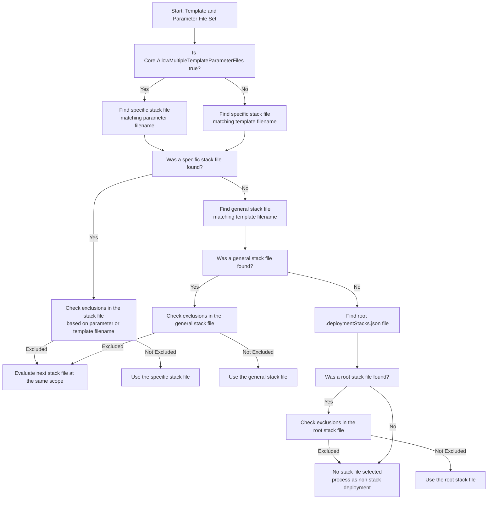

# AzOps Managed Deployment Stacks

- [Introduction](#introduction)
- [Settings](#deployment-stacks-settings)
  - [Exclusions](#deployment-stacks-exclusions)
- [Hierarchy](#deployment-stacks-hierarchy)
  - [Processing Logic](#deployment-stacks-processing)
    - [DeploymentStacks Name](#deployment-stacks-name)

## Introduction

As a part of **AzOps Push**, the module handles creation of deployment stacks and deletion of deployment stacks based on your custom templates. The stacks configuration is managed by `.deploymentStacks.json` files and are supported at three scope levels: management group, subscription, resource group.

AzOps utilizes the Az PowerShell Module Cmdlets: `New-AzResourceGroupDeploymentStack`, `New-AzSubscriptionDeploymentStack` or `New-AzManagementGroupDeploymentStack` to create/set/update the [`Microsoft.Resources/deploymentStacks`](https://learn.microsoft.com/en-us/azure/azure-resource-manager/bicep/deployment-stacks) resource with `-Force`.

_AzOps managed deployment stacks processing is only supported with custom templates, meaning AzOps Pulled templates are not intended to work with `.deploymentStacks.json` files._

**_Please Note_**

- SPN used for AzOps, requires below actions in its role definition or one of the following built-in roles `Azure Deployment Stack Owner` or `Azure Deployment Stack Contributor`. Choose which combination best suits your implementation.

```bash
    Microsoft.Resources/deploymentStacks/*
```
or
```bash
    Microsoft.Resources/deploymentStacks/write
    Microsoft.Resources/deploymentStacks/read
```

## Deployment Stacks Settings

To control and configure the AzOps Managed Deployment Stacks, usage of settings files `.deploymentStacks.json` are key.

They are expected to be `.json` formatted and have names that indicate their template/parameter file set relation. The presence of a `.deploymentStacks.json` matching a relation with template/parameter file set will trigger AzOps to manage that template/parameter file set as a `Microsoft.Resources/deploymentStacks` configured according to the `.deploymentStacks.json` file.

Below is an example `.deploymentStacks.json` file:
```json
{
    "actionOnUnmanage": "deleteResources",
    "bypassStackOutOfSyncError": false,
    "denySettingsMode": "DenyDelete",
    "excludedAzOpsFiles": [
        "dontLookAtMe.bicep"
    ]
}
```

The following settings are honored by AzOps:
- ActionOnUnmanage
- DenySettingsMode
- DenySettingsExcludedPrincipal
- DenySettingsExcludedAction
- DenySettingsApplyToChildScopes
- BypassStackOutOfSyncError
- Location
- ExcludedAzOpsFiles

The allowed value for each of the parameter except for `excludedAzOpsFiles` are derived by enumerating the respective Cmdlets: `New-<scope>DeploymentStack`.

### Deployment Stacks Exclusions

Deployment stack exclusions allow you to exclude specific templates or parameter files from being processed by AzOps as `Microsoft.Resources/deploymentStacks`. Below are examples of how to configure exclusions:

**I want to use one `.deploymentStacks.json` and have all custom templates at that scope use it**

Can AzOps settings be configured to enable this?

Yes, ensure you have a root `.deploymentStacks.json` file placed at that scope level.
```bash
Folder/
├── .deploymentStacks.json
├── template1.bicep
└── template2.bicep
```
```json
{
    "actionOnUnmanage": "deleteResources",
    "bypassStackOutOfSyncError": false,
    "denySettingsMode": "DenyDelete",
    "excludedAzOpsFiles": []
}
```
**But now i need to exclude `template2.bicep` from deployment stacks processing**

Can AzOps settings be configured to enable this?

Yes, let's edit the root `.deploymentStacks.json` file placed at that scope level.
```json
{
    "actionOnUnmanage": "deleteResources",
    "bypassStackOutOfSyncError": false,
    "denySettingsMode": "DenyDelete",
    "excludedAzOpsFiles": [
      "template2.bicep"
    ]
}
```

**But now i realise i want to have `template2.bicep` managed by deployment stacks, however it needs different settings than the root `.deploymentStack.json` file**

Yes, let's create a file called `template2.deploymentStacks.json` file placed at that scope level.
```bash
Folder/
├── .deploymentStacks.json
├── template1.bicep
├── template2.deploymentStacks.json
└── template2.bicep
```
```json
{
    "actionOnUnmanage": "deleteResources",
    "bypassStackOutOfSyncError": true,
    "denySettingsMode": "DenyDelete",
    "excludedAzOpsFiles": []
}
```
Once the `template2.deploymentStacks.json` file exists the `excludedAzOpsFiles` setting at the root `.deploymentStacks.json` file is no longer necessary.

## Deployment Stacks Hierarchy

The deployment stacks hierarchy defines how `.deploymentStacks.json` files are organized and applied across different Azure scopes, such as management groups, subscriptions, and resource groups. This hierarchy ensures that deployment stack configurations are applied in a structured and predictable manner, allowing for flexibility and granularity in managing custom templates.

- **Scope Levels**: Deployment stacks can be configured at various scope levels, including management groups, subscriptions, and resource groups. The most specific configuration at a given scope takes precedence.
- **File Structure**: The hierarchy relies on the placement of `.deploymentStacks.json` files within the folder structure. These files can be scoped (e.g., folder root-level) or specifically (e.g., tied to individual templates).
- **Inheritance and Overrides**: A root `.deploymentStacks.json` file can provide default settings for all templates at a scope. However, specific `.deploymentStacks.json` files can override these settings for individual templates or parameter files.
- **Exclusions**: Templates can be excluded from deployment stack processing by specifying them in the `excludedAzOpsFiles` setting of a `.deploymentStacks.json` file.

The following diagram illustrates the folder structure for managing deployment stacks at different levels:



### Deployment Stacks Processing

The most specific deploymentstack configuration (at scope) will be selected by considering the following:
- **Specificity Matters**: The most specific `.deploymentStacks.json` file at a given scope (e.g., matching the parameter or template filename) is prioritized.
- **Exclusion Handling**: Files listed in the `excludedAzOpsFiles` setting of a `.deploymentStacks.json` file are skipped during processing.
- **Fallback Logic**: If no specific or general `.deploymentStacks.json` file is found, the root `.deploymentStacks.json` file is used, if available.
- **Non Stack Deployment**: If no applicable `.deploymentStacks.json` file is found or all are excluded, the template is processed as a non-stack deployment.
- **Multiple Template/Parameter Files**: The `Core.AllowMultipleTemplateParameterFiles` setting determines whether parameter or template filenames are used to locate specific stack files.
- **Override Mechanism**: Specific `.deploymentStacks.json` files override root-level settings, enabling granular control for individual templates.


#### Deployment Stacks Name

AzOps constructs the deployment stack name deterministically based on the associated template and parameter filename. The base name of the fileis sanitized by removing unnecessary parts (e.g., extensions like `.bicepparam`), truncated to 53 characters if necessary, and combined with a deterministic 4-character hash derived from the `DefaultDeploymentRegion`.

For example:
- Template file: `template.bicep`
- Parameter file: `template.x1.bicepparam`
- Default region: `eastus`

The resulting deployment stack name would be: `AzOps-template-x1-1a2b`.

This naming convention ensures that deployment stack names are unique, predictable, and region-specific, allowing for consistent management of deployment stacks across different scopes and regions.

**_The Deployment Stacks Name is critical to enable consistent processing and accurate lifecycle management of the stack and its resources._**