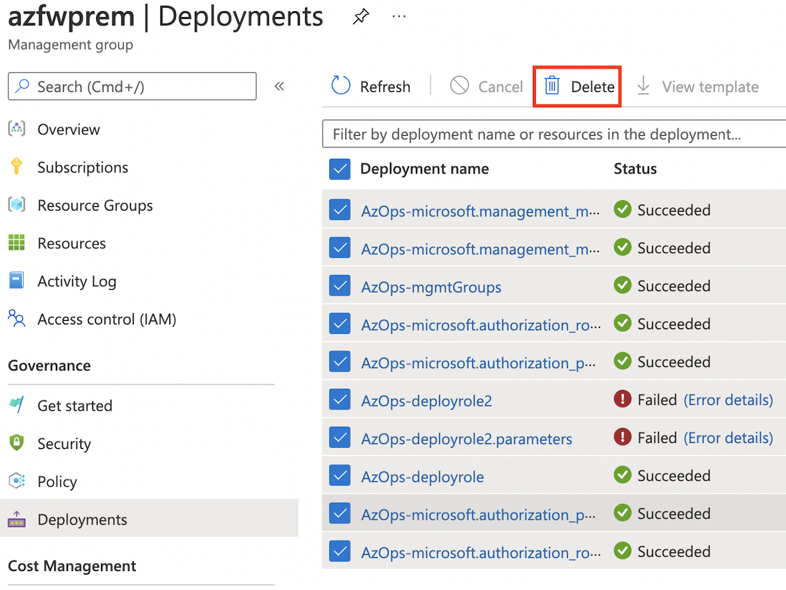
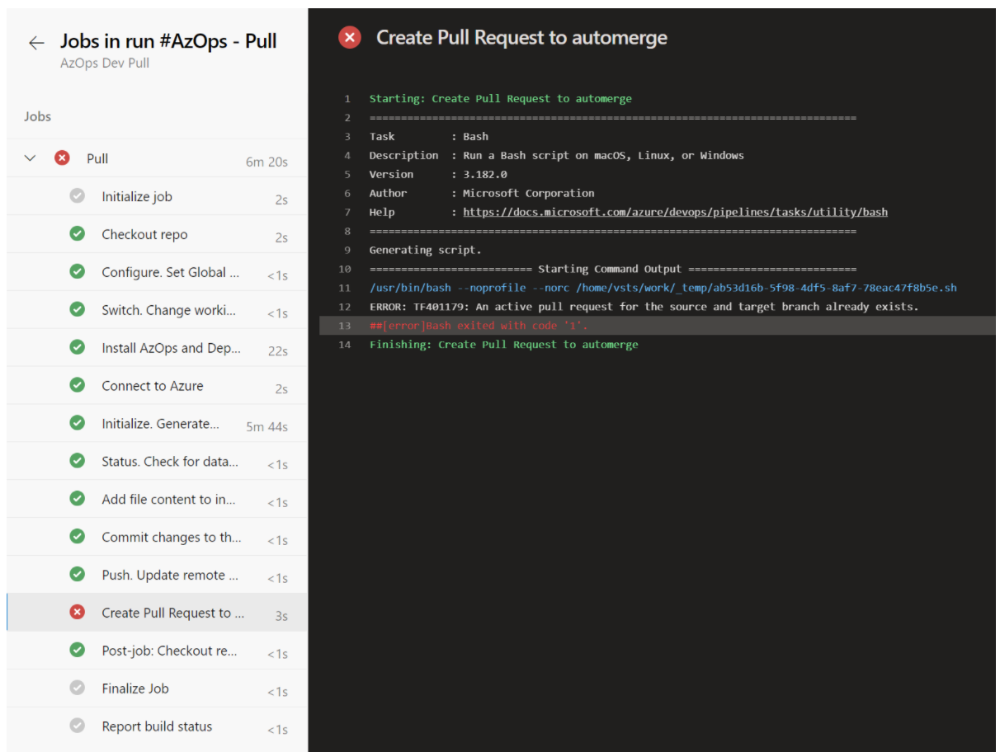
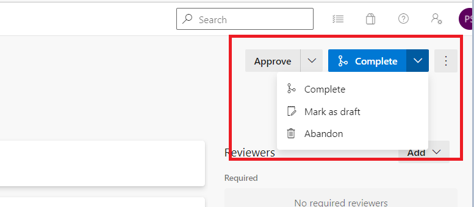

# AzOps FAQ

This article answers frequently asked questions relating to AzOps.

## In this Section

- [AzOps FAQ](#azops-faq)
  - [In this Section](#in-this-section)
  - [Subscriptions or resources not showing up in repository](#subscriptions-or-resources-not-showing-up-in-repository)
  - [Push fail with deployment already exists in location error](#push-fail-with-deployment-already-exists-in-location-error)
  - [Pull fail with active pull request already exists error](#pull-fail-with-active-pull-request-already-exists-error)
  - [Discovery scenarios and settings](#discovery-scenarios-and-settings)
    - [**I want to discover all resources across all resource groups in one specific subscription**](#i-want-to-discover-all-resources-across-all-resource-groups-in-one-specific-subscription)
    - [**I want to discover all resources in specific resource groups in one specific subscription**](#i-want-to-discover-all-resources-in-specific-resource-groups-in-one-specific-subscription)
    - [**I want to discover a specific resource type in specific resource group in one specific subscription**](#i-want-to-discover-a-specific-resource-type-in-specific-resource-group-in-one-specific-subscription)
    - [**I want to discover and manage several Azure Firewall Policy's and rule collections spread out across several resource groups and subscriptions**](#i-want-to-discover-and-manage-several-azure-firewall-policys-and-rule-collections-spread-out-across-several-resource-groups-and-subscriptions)

## Subscriptions or resources not showing up in repository

If there are invalid characters in the resource path, discovery of subscriptions, resource groups or resources will fail during push or pull operations.

To confirm if this applies to you, check the pipeline logs for any of the following messages:

```powershell
[ConvertTo-AzOpsState] The specified AzOpsState file contains invalid characters (remove any "[" or "]" characters)! <PathToResource>
```

```powershell
[New-AzOpsScope] Path not found: <PathToResource>
```

Remove the invalid resource or character and retry the operation.

## Push fail with deployment already exists in location error

If you have changed `"Core.DefaultDeploymentRegion":` from the default `northeurope` post initial setup, subsequent Push/Deployments might fail with an error as below:

`Invalid deployment location 'westeurope'. The deployment 'AzOps-microsoft.management_managementgroups-nested' already exists in location 'northeurope'`

This happens because [it is unsupported in ARM](https://docs.microsoft.com/en-us/azure/azure-resource-manager/templates/deploy-to-management-group?tabs=azure-cli#deployment-location-and-name) to create a deployment in one location when there's an existing deployment with the same name in a different location.

To resolve the error, remove the failed deployment(s) from the target scope and re-run the failed Push pipeline. This can be done either under 'Deployments' at the particular scope in the Azure portal  or with [PowerShell](https://docs.microsoft.com/en-us/powershell/module/az.resources/remove-azmanagementgroupdeployment?view=azps-7.1.0)/[Azure CLI](https://docs.microsoft.com/en-us/cli/azure/deployment/mg?view=azure-cli-latest#az-deployment-mg-delete)/[REST](https://docs.microsoft.com/en-us/rest/api/resources/deployments/delete-at-management-group-scope).


## Pull fail with active pull request already exists error

Pull pipeline failed during `Create Pull Request to automerge` task with an error as below:

`ERROR: TF401179: An active pull request for the source and target branch already exists.`

This happens because it is not supported in Azure DevOps to create a pull request when there's an existing pull request created for the same source and target branch.



To resolve the error, [complete or abandon the existing pull request (PR)](https://docs.microsoft.com/en-us/azure/devops/repos/git/complete-pull-requests?view=azure-devops&tabs=browser) first and then rerun the pipeline.



## Discovery scenarios and settings

### **I want to discover all resources across all resource groups in one specific subscription**

Can AzOps settings be configured to enable this?

Yes, ensure the following setting combinations are applied (replace `SubscriptionId` with your specific information)

```bash
    "Core.IncludeResourcesInResourceGroup": ["*"]

    "Core.IncludeResourceType": ["*"]

    "Core.SkipResource": false

    "Core.SkipResourceGroup": false

    "Core.SubscriptionsToIncludeResourceGroups": ["SubscriptionId"]
```

### **I want to discover all resources in specific resource groups in one specific subscription**

Can AzOps settings be configured to enable this?

Yes, ensure the following setting combinations are applied (replace `rgname1`, `rgname2`, `rgname3` and `SubscriptionId` with your specific information)

```bash
    "Core.IncludeResourcesInResourceGroup": ["rgname1","rgname2","rgname3"]

    "Core.IncludeResourceType": ["*"]

    "Core.SkipResource": false

    "Core.SkipResourceGroup": false

    "Core.SubscriptionsToIncludeResourceGroups": ["SubscriptionId"]
```

### **I want to discover a specific resource type in specific resource group in one specific subscription**

Can AzOps settings be configured to enable this?

Yes, ensure the following setting combinations are applied (replace `rgname1`, `resource-provider/resource-type` and `SubscriptionId` with your specific information)

```bash
    "Core.IncludeResourcesInResourceGroup": ["rgname1"]

    "Core.IncludeResourceType": ["resource-provider/resource-type"]

    "Core.SkipResource": false

    "Core.SkipResourceGroup": false

    "Core.SubscriptionsToIncludeResourceGroups": ["SubscriptionId"]
```

### **I want to discover and manage several Azure Firewall Policy's and rule collections spread out across several resource groups and subscriptions**

Can AzOps settings be configured to enable this?

Yes, ensure the following setting combinations are applied (replace `rgname1`, `rgname2`, `Microsoft.Network/firewallPolicies` and `SubscriptionId1`, `SubscriptionId2` with your specific information)

```bash
    "Core.IncludeResourcesInResourceGroup": ["rgname1","rgname2"]

    "Core.IncludeResourceType": ["Microsoft.Network/firewallPolicies"]

    "Core.SkipResource": false

    "Core.SkipChildResource": false

    "Core.SkipResourceGroup": false

    "Core.SubscriptionsToIncludeResourceGroups": ["SubscriptionId1","SubscriptionId2"]
```

### **I want to deploy a set of templates in a specific order**

Can AzOps settings be configured to enable this?

Yes, ensure that the variable `AZOPS_CUSTOM_SORT_ORDER` is set to `true` and create a file named `.order` in the same folder as your template files.  
Template files listed in the order file will be deployed in the order specified in the file and before any other templates.
