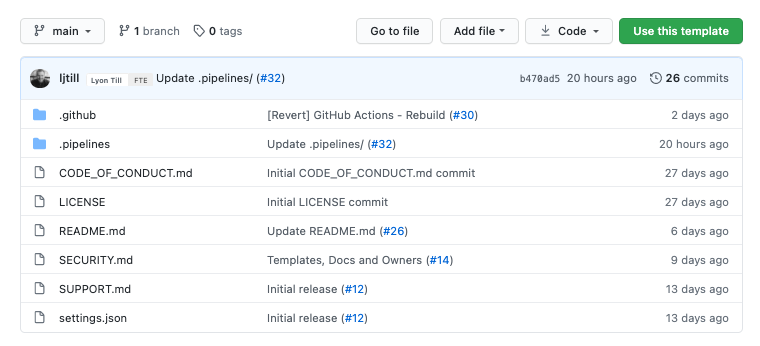
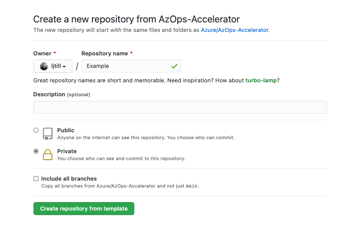
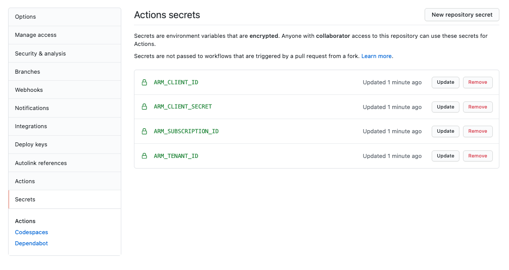
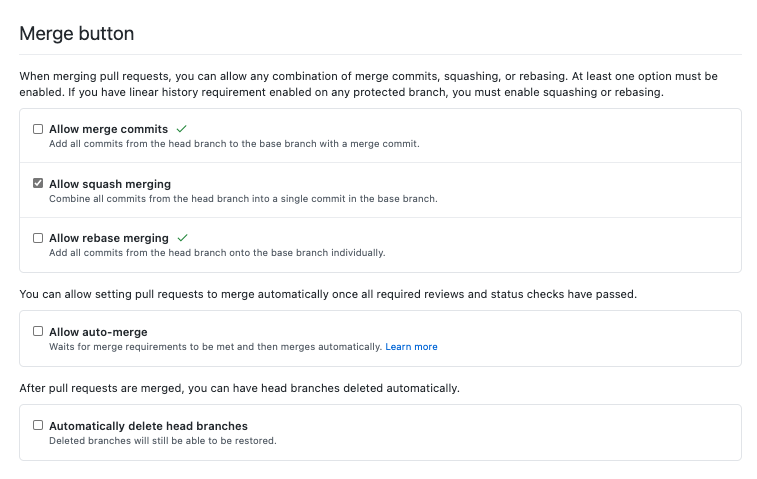

_Coming soon_

### In this guide

- [Commands](#commands)
- [Portal](#portal)
  - [Create the repository](#create-the-repository)
  - [Configure the secrets](#configure-the-secrets)

---

### Commands

```bash
az ad sp create-for-rbac --name "AzOps" --role owner --scope /
```

```bash
gh repo create '<Name>' --template azure/azops-accelerator --private --confirm
```

```bash
gh secret set 'ARM_TENANT_ID' -b "<Secret>"
gh secret set 'ARM_SUBSCRIPTION_ID' -b "<Secret>"
gh secret set 'ARM_CLIENT_ID' -b "<Secret>"
gh secret set 'ARM_CLIENT_SECRET' -b "<Secret>"
```

```bash
gh api -X POST /repos/:owner/:repo/dispatches -f event_type='Enterprise-Scale Deployment'
```

---

### Portal

#### Create the repository

Browse to the [AzOps Accelerator](https://github.com/azure/azops-accelerator), and select *Use this template*



Select whether the owner will be an organization or user and provide a repository name.

We'd recommended creating the new repository as *private*.

There is no need to include all branches as all latest stable changes reside within the main branch.



#### Configure the secrets

Navigate to *settings* on the newly created repository, select the *Secrets* section.

Create the following repository secrets:



Select the *Options* sections, untick *Merge commits* and *Rebase merging*.



---


