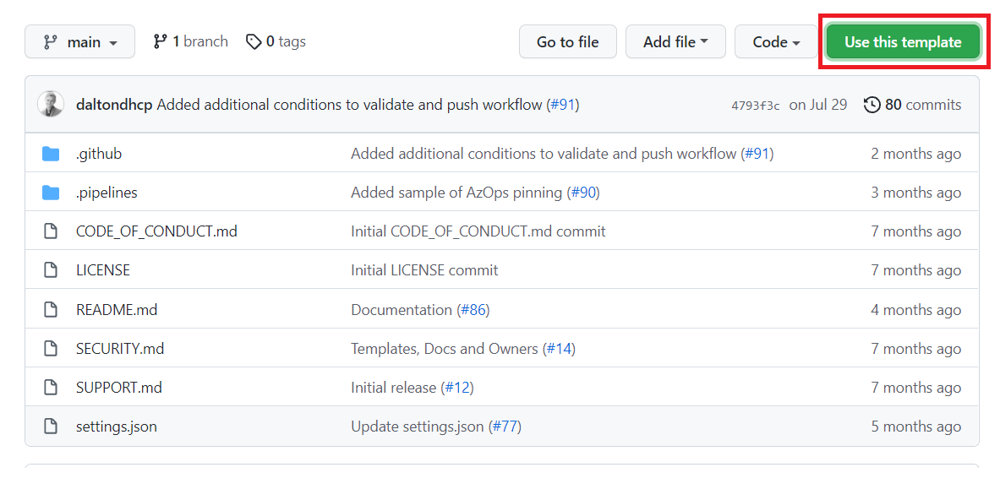
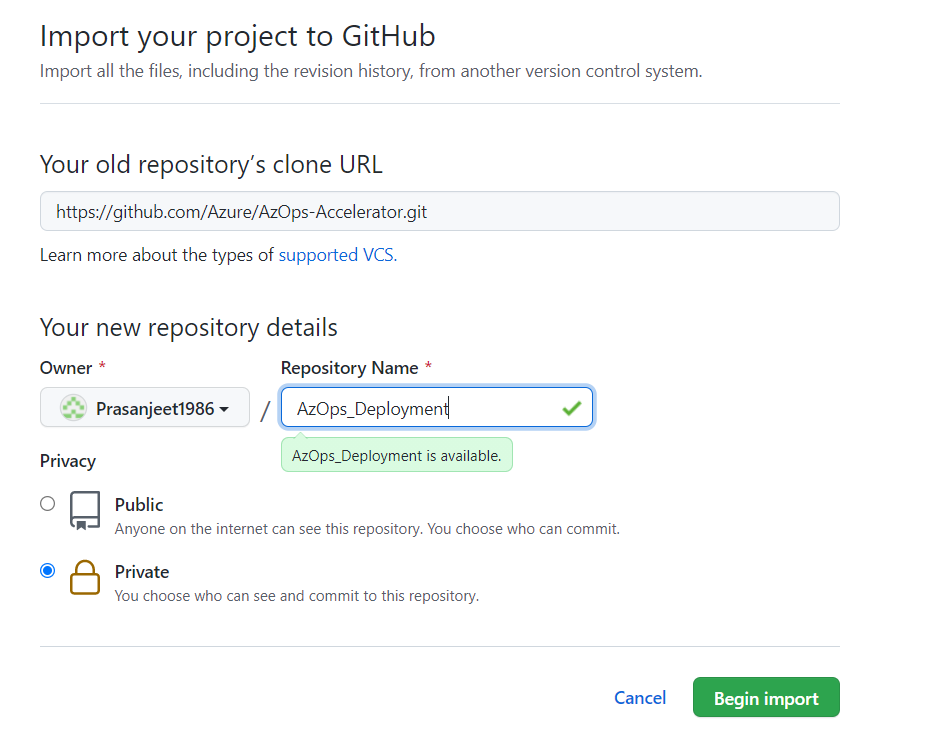
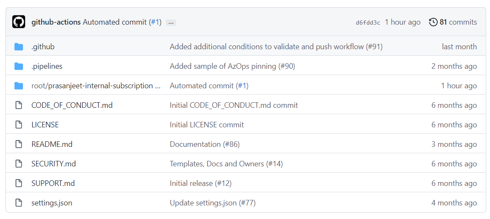
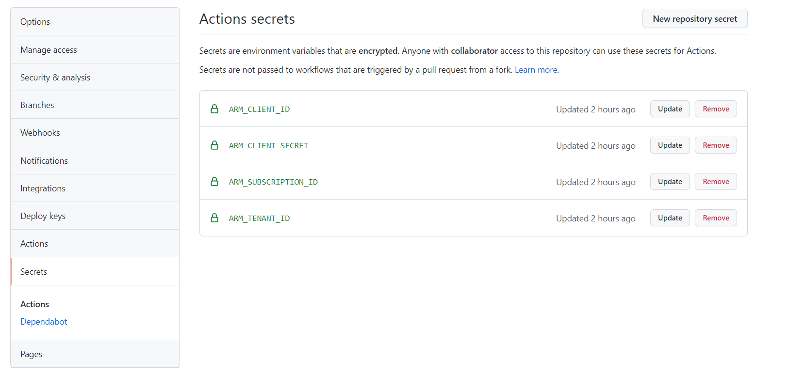
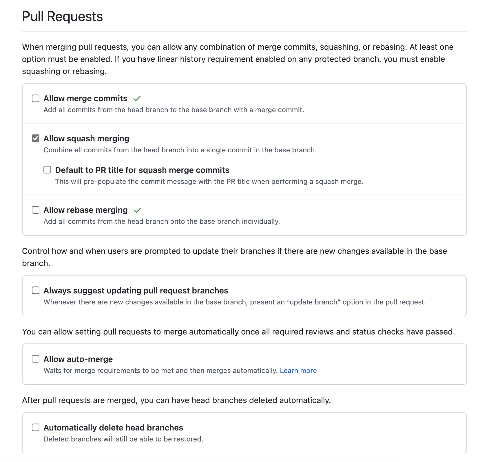
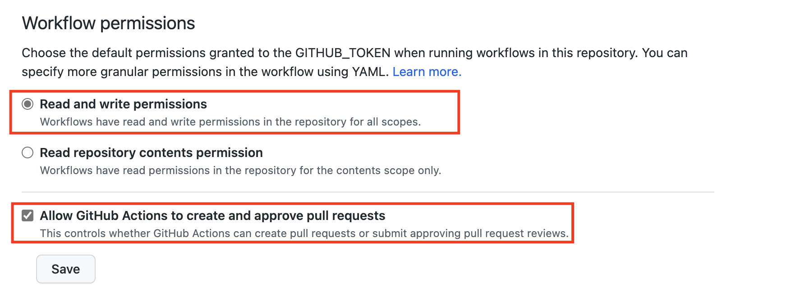
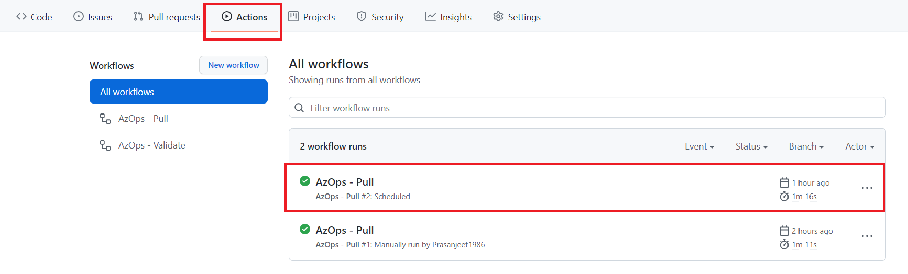
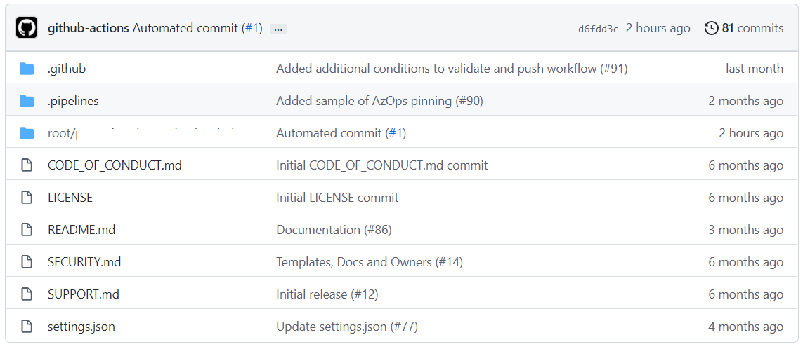

# AzOps Via GitHub

- [Prerequisites](#prerequisites)
  - [Further reading](#further-reading)
  - [Important Repository Link to refer](#important-repository-link-to-refer)
- [Two ways to configure AzOps](#Two-ways-to-configure-AzOps)
- [Configure AzOps via Portal](#Configure-AzOps-via-Portal)
- [Configure via command-line](#Configure-via-command-line)

## Prerequisites

Before you start, make sure you have followed the steps in the [prerequisites](https://github.com/azure/azops/wiki/prerequisites) article to configure the required permissions for AzOps.

If you are planning to use self-hosted runners, also verify that all [required software](https://github.com/azure/azops/wiki/self-hosted#required-software) is installed on your runners.

AzOps is supported with [GitHub Enterprise Server version 3.4.0](https://docs.github.com/en/enterprise-server@3.4/admin/release-notes#github-actions-reusable-workflows-in-public-beta) or newer.

### Further reading

Links to documentation for further reading:

- [Create the Service Principal](https://learn.microsoft.com/azure/active-directory/develop/howto-create-service-principal-portal)
- [Assign the permissions at the required scope (/)](https://learn.microsoft.com/azure/active-directory/develop/howto-create-service-principal-portal)
- [Assign the Directory role permissions](https://learn.microsoft.com/azure/active-directory/roles/manage-roles-portal)

### Important Repository link to refer

| Repository                                                            | Description                                                                               |
| ------------------------------------------------------------------- | ----------------------------------------------------------------------------------------- |
| [AzOps-Accelerator](https://github.com/Azure/AzOps-Accelerator) | This template repository is for getting started with the AzOps integrated CI/CD solution. |

### Two ways to configure AzOps

- Via GitHub portal
- Via command-line [GitHub CLI](https://cli.github.com/)

### Configure AzOps via Portal

1. Navigate to the [AzOps-Accelerator](https://github.com/Azure/AzOps-Accelerator) repository and click on `Use this template` button to create new repository.
If you are using GitHub Enterprise Server, you need to [import the repository](https://docs.github.com/en/enterprise-server/get-started/importing-your-projects-to-github/importing-source-code-to-github/importing-a-git-repository-using-the-command-line) using the command-line.

2. Specify whether the new repository should be public or private.

3. Review the information you entered, then click Begin import.

4. Navigate to Settings -> Secrets -> Actions and create the required secrets as depicted below

5. Untick `Allow merge commits` and `Allow rebase merging` under Settings -> General -> Pull Requests

6. Under Settings -> Actions -> General -> Workflow permissions, grant the workflow `Read and write permissions` as well as `Allow GitHub Actions to create and approve pull requests`

7. Navigate to Actions and run the `AzOps - Pull` workflow to create a representation of the existing Azure environment/scopes in the repository. The artifacts will by default be stored under the `root` folder.


    > Note: All the configuration values can be modified through the `settings.json` file to change the default behavior of AzOps. The settings are documented under [settings](https://github.com/azure/azops/wiki/settings)
8. The repository is now ready for use. Creating a Pull Request with changes to the `root` folder will trigger the validate pipeline. The validate pipeline will then perform a What-If deployment of the changes and post the results as a comment on the pull request.
    - Merging the pull request will rigger the push pipeline and deploy the changes to Azure.

### Configure via command-line

- Create the repository from the predefined template

```git
gh repo create '<Name>' --template azure/azops-accelerator --private --confirm
```

- Add the repository secrets

```git
gh secret set 'ARM_TENANT_ID' -b "<Secret>"
gh secret set 'ARM_SUBSCRIPTION_ID' -b "<Secret>"
gh secret set 'ARM_CLIENT_ID' -b "<Secret>"
gh secret set 'ARM_CLIENT_SECRET' -b "<Secret>"
```

- Disable Allow Merge commits and Allow rebase merging

```git
gh api -X PATCH /repos/{owner}/{repo} -f allow_rebase_merge=false
gh api -X PATCH /repos/{owner}/{repo} -f allow_merge_commit=false
```

- Grant workflow "Read and write permissions" and "Allow GitHub Actions to create and approve pull requests" permissions

```git
gh api -X PUT /repos/{owner}/{repo}/actions/permissions/workflow -f default_workflow_permissions='write'
gh api -X PUT /repos/{owner}/{repo}/actions/permissions/workflow -F can_approve_pull_request_reviews=true
```

- Initiate the first Pull workflow

```git
gh api -X POST /repos/{owner}/{repo}/dispatches -f event_type='Enterprise-Scale Deployment'
```
