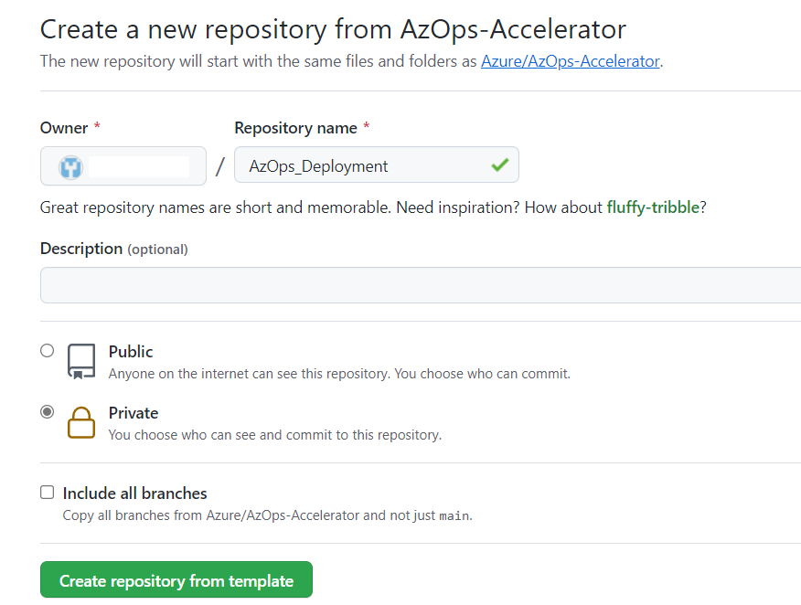

# AzOps Via GitHub

- [Prerequisites](#prerequisites)
  - [Further reading](#further-reading)
  - [Important Repository Link to refer](#important-repo-link-to-refer)
- [Two ways to configure AzOps](#Two-ways-to-configure-AzOps)
- [Configure AzOps via Portal](#Configure-AzOps-via-Portal)
- [Configure via command-line script](#Configure-via-command-line-script)

## Prerequisites

Before you start, make sure you have followed the steps in the [prerequisites](.\Prerequisites.md) article to configure the required permissions for AzOps.

### Further reading

Links to documentation for further reading:

- [Create the Service Principal](https://docs.microsoft.com/azure/active-directory/develop/howto-create-service-principal-portal)
- [Assign the permissions at the required scope (/)](https://docs.microsoft.com/azure/active-directory/develop/howto-create-service-principal-portal)
- [Assign the Directory role permissions](https://docs.microsoft.com/azure/active-directory/roles/manage-roles-portal)

### Important Repository link to refer

| Repository                                                            | Description                                                                               |
| ------------------------------------------------------------------- | ----------------------------------------------------------------------------------------- |
| [AzOps Accelerator](https://github.com/Azure/AzOps-Accelerator.git) | This template repository is for getting started with the AzOps integrated CI/CD solution. |

### Two ways to configure AzOps

- via GitHub portal
- Via command-line script (GitHub )

### Configure AzOps via Portal

- AzOps Accelerator is a template repository and repository can directly created using `Use this template`.[Repository](https://github.com/Azure/AzOps-Accelerator.git)

    1. Click on `Use this template` Button to create new repository.

        

    2. Specify whether the new repository should be public or private.

        

    3. Review the information you entered, then click Begin import.

        

- Create a service principal in Azure which will further be used for deployment via AzOps.
    1. Sign in to your Azure Account through the Azure portal.

    2. Select Azure Active Directory.

    3. Select App registrations.

    4. Name the application. Select a supported account type, which determines who can use the application.
      

- Assign a role to the SPN
    1. In the Azure portal, select the level of scope you wish to assign the application to. For example, to assign a role at the subscription scope, search for and select Subscriptions, or select Subscriptions on the Home page.
    

    2. Select the particular subscription to assign the application to.
    
If you don't see the subscription you're looking for, select global subscriptions filter. Make sure the subscription you want is selected for the portal.

    3. Select Access control (IAM).

    4. Select Select Add > Add role assignment to open the Add role assignment page.

    5. Select the role you wish to assign to the application. For example, to allow the application to execute actions like reboot, start and stop instances, select the Contributor role.

    > Note: If this SPN is require to be used for assigning RBAC, then Owner access.

- Configure the secrets: Navigate to settings on the newly created repository, select the Secrets section to create new secret.

    

- Select the Options sections, untick Merge commits and Rebase merging.

    
- All the configuration values can be modified within the `settings.json` file to change the default behavior of AzOps.
  The settings are documented in [Settings chapter](.\Settings.md)

- Now, We are good to trigger pull to fetch the existing Azure environment. Navigate to Actions and run `AzOps - Pull`
  

- Once, pull pipeline complete it will look like below screenshot.

- This `root` folder contains existing state of Azure environment.
- Now, start creating arm template to deployment more resources as shown in below screenshot.


> Note: Please follow above naming convention for parameter file creation.

- Run the Push pipeline to apply the update.


### Configure via command-line script

- Create the repository from the predefined template

```git
gh repo create '<Name>' --template azure/azops-accelerator --private --confirm
```

- Add the repository secrets

```git
gh secret set 'ARM_TENANT_ID' -b "<Secret>"
gh secret set 'ARM_SUBSCRIPTION_ID' -b "<Secret>"
gh secret set 'ARM_CLIENT_ID' -b "<Secret>"
gh secret set 'ARM_CLIENT_SECRET' -b "<Secret>"
```

- Disable Allow Merge commits and Allow rebase merging

```git
gh api -X PATCH /repos/{owner}/{repo} -f allow_rebase_merge=false
gh api -X PATCH /repos/{owner}/{repo} -f allow_merge_commit=false
```

- Initiate the first Pull workflow

```git
gh api -X POST /repos/{owner}/{repo}/dispatches -f event_type='Enterprise-Scale Deployment'
```
