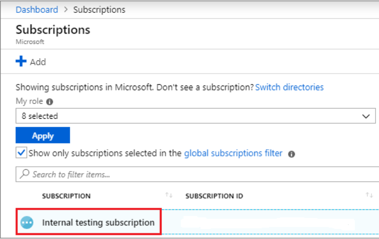

# AzOps Via GitHub


## Table of Content

[[_TOC_]]

## Prerequisites

* [Create the Service Principal](https://docs.microsoft.com/en-us/azure/active-directory/develop/howto-create-service-principal-portal)

* [Assign the permissions at the required scope (/)](https://docs.microsoft.com/en-us/azure/active-directory/develop/howto-create-service-principal-portal)
* Assign the Directory role permissions

* [Create project](https://docs.microsoft.com/en-us/azure/devops/organizations/projects/create-project?view=azure-devops&tabs=preview-page)

Please check if the Az and AzureAD modules are installed locally before executing these scripts. Alternatively, these command can be run within a Cloud Shell instance.

### Powershell command to create SPN:
```powershell
Connect-AzAccount
$servicePrincipal = New-AzADServicePrincipal -Role Owner -Scope / -DisplayName AzOps
Write-Host "ARM_TENANT_ID: $((Get-AzContext).Tenant.Id)"
Write-Host "ARM_SUBSCRIPTION_ID: $((Get-AzContext).Subscription.Id)"
Write-Host "ARM_CLIENT_ID: $($servicePrincipal.ApplicationId)"
Write-Host "ARM_CLIENT_SECRET: $($servicePrincipal.Secret | ConvertFrom-SecureString -AsPlainText)"
```
### Powershell command to assign the Directory role permissions

```powershell
Install-Module -Name AzureAD
Connect-AzureAD
$servicePrincipal = Get-AzureADServicePrincipal -Filter "DisplayName eq 'AzOps'"
$directoryRole = Get-AzureADDirectoryRole -Filter "DisplayName eq 'Directory Readers'"
if ($directoryRole -eq $null) {
    Write-Warning "Directory Reader role not found"
}
else {
    Add-AzureADDirectoryRoleMember -ObjectId $directoryRole.ObjectId -RefObjectId $servicePrincipal.ObjectId
}
```

## Important Repo Link to refer:- 

Repo | Description
-|-
[AzOps Accelerator](https://github.com/Azure/AzOps-Accelerator.git) | This template repository is for getting started with the AzOps integrated CI/CD solution.

##  Two ways to configure AzOps:-
- via Potal
- Via command line script

## configure AzOps via Potal

- Import the above [Repo](https://github.com/Azure/AzOps-Accelerator.git) to new project.

    1. In the upper-right corner of any page, click  and then click Import repository.

        

    2. Under "Your old repository's clone URL", type the URL of the project you want to import.

        

    3. Specify whether the new repository should be public or private.

        

    4. Review the information you entered, then click Begin import.

        

-  create a service principle in Azure which will further be used for deployment via AzOps.
    1. Sign in to your Azure Account through the Azure portal.

    2. Select Azure Active Directory.

    3. Select App registrations.

    4. Name the application. Select a supported account type, which determines who can use the application.
      

-  Assign a role to the SPN
    1. In the Azure portal, select the level of scope you wish to assign the application to. For example, to assign a role at the subscription scope, search for and select Subscriptions, or select Subscriptions on the Home page.
    

    2. Select the particular subscription to assign the application to.
     
If you don't see the subscription you're looking for, select global subscriptions filter. Make sure the subscription you want is selected for the portal.

    3. Select Access control (IAM).

    4. Select Select Add > Add role assignment to open the Add role assignment page.

    5. Select the role you wish to assign to the application. For example, to allow the application to execute actions like reboot, start and stop instances, select the Contributor role.

    > Note: If this SPN is require to be used for assigning RBAC, then Owner access.

- Configure the secrets: Navigate to settings on the newly created repository, select the Secrets section to create new secret.

     

- Select the Options sections, untick Merge commits and Rebase merging.

     
- All the configuration values can be modified within the `settings.json` file to change the default behavior of AzOps.      

    Id|Name|Description|Example
    -|-|-|-
    01|AutoGeneratedTemplateFolderPath|Generates the Folder within the `root` folder to keep all the standalone json file like Policy , Subscription detail etc.("Core.AutoGeneratedTemplateFolderPath": "/.az")|
    02|DefaultDeploymentRegion|This switch will to be used to set the default region for deployments|`"Core.DefaultDeploymentRegion": "northeurope"`
    03|EnrollmentAccountPrincipalName| Switch will be used to set the default enrollment account in case of Subscription creation|`"Core.EnrollmentAccountPrincipalName": ""`|
    04|ExcludedSubOffer|This switch excludes speicific Subscription offer types from getting pulled |`"Core.ExcludedSubOffer": [ "AzurePass_2014-09-01","FreeTrial_2014-09-01","AAD_2015-09-01"]`|
    05|ExcludedSubState|This switch excludes  specific states of Subscription from getting pulled |`"Core.ExcludedSubState": ["Disabled","Deleted","Warned","Expired"]`|
    06|IgnoreContextCheck|This switch skip Azure PowerShell context validation, if it set to true|`"Core.IgnoreContextCheck": false`
    11|OfferType|Set the default offer type for Subscriptions for pull|`"Core.OfferType": "MS-AZR-0017P"`
    07|PartialMgDiscoveryRoot| This switch will generate seperate folder hierachy for specific Management Groups if mentioned|`"Core.PartialMgDiscoveryRoot": []"`
    08|SkipPolicy| If this set to `True`, then it will avoid creating/pulling Azure Policy state of the environment in json file|`"Core.SkipPolicy": false`
    09|SkipResource|If this set to `True`, then it will avoid creating/pulling Azure resources within the resources group information in json file|`"Core.SkipResource": false`
    10|SkipResourceGroup|If this set to `false`, then it will generate folder hierachy for all Resource Groups in the Azure infra|`"Core.SkipResourceGroup": false`
    11|SkipRole|If this set to `false`, then it will generate file for RBAC information in the Azure infra|`"Core.SkipRole": false`
    12|State|It generate default top level folder in the repository with the name defined in the setting file|
    13|SubscriptionsToIncludeResourceGroups|If `*` is mentioned then, it will generate folder hierachy for all Resource Groups, else specific resource group can be mentioned |`"Core.SubscriptionsToIncludeResourceGroups": "*"`
    14|TemplateParameterFileSuffix|Its generated the template file with specific file suffix|`"Core.TemplateParameterFileSuffix": ".json"`

- Now, We are good to trigger pull to fech the existing Azure environment. Navigate to Actions and run `AzOps - Pull`
  

- Once, pull pipeline complete it will look like below screenshot.

- This `root` folder contains existing state of Azure environment.
- Now, start creating arm template to deployment more resources as shown in below screen shot.


> Note: Please follow above naming convention for parameter file creation.

- Run the Push pipeline to apply the update.


## Configure via command line script

- Create the repository from the pre-defined template

```git
gh repo create '<Name>' --template azure/azops-accelerator --private --confirm
```
- Add the repository secrets
```git
gh secret set 'ARM_TENANT_ID' -b "<Secret>"
gh secret set 'ARM_SUBSCRIPTION_ID' -b "<Secret>"
gh secret set 'ARM_CLIENT_ID' -b "<Secret>"
gh secret set 'ARM_CLIENT_SECRET' -b "<Secret>"
```
- Disable Allow Merge commits and Allow rebase merging

```git
gh api -X PATCH /repos/{owner}/{repo} -f allow_rebase_merge=false
gh api -X PATCH /repos/{owner}/{repo} -f allow_merge_commit=false
```
- Initiaite the first Pull workflow

```git
gh api -X POST /repos/{owner}/{repo}/dispatches -f event_type='Enterprise-Scale Deployment'
```
