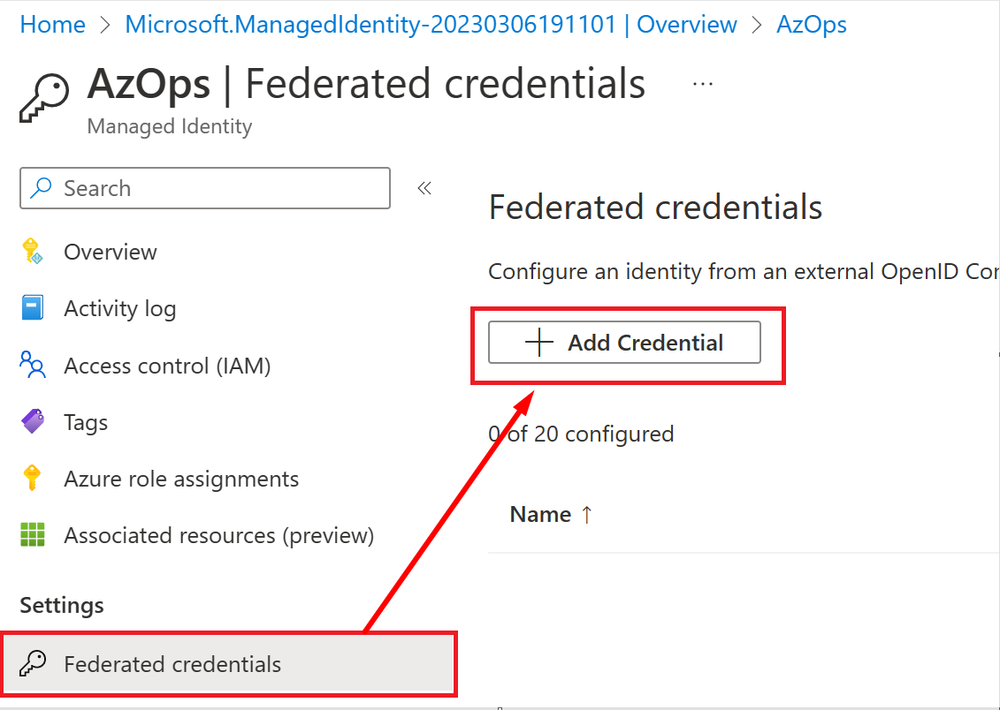
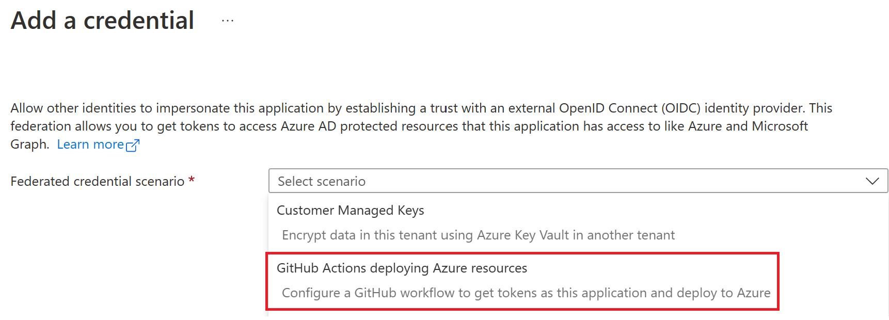
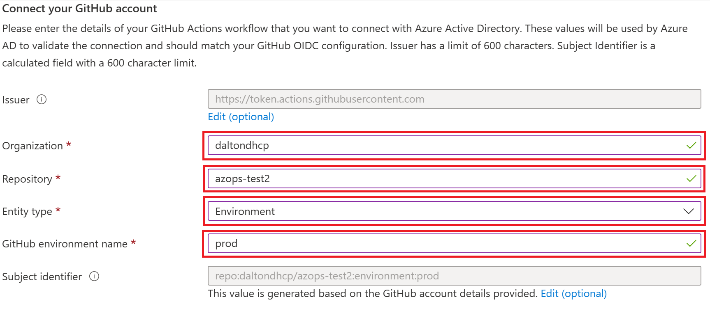
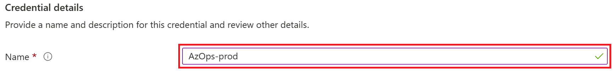
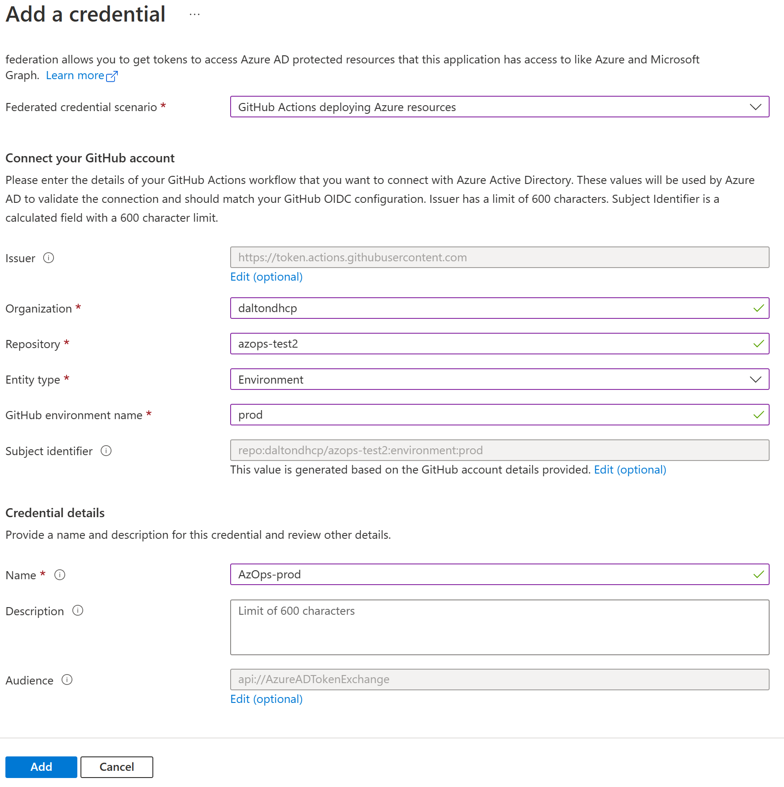

# Use Workload identity federation with the AzOps GitHub Actions

- [Introduction](#introduction)
- [Configure](#configure)
- [Resources](#resources)

## Introduction

GitHub Actions support OpenID Connect (OIDC) for secure deployments to Azure, which uses short-lived tokens that are automatically rotated for each deployment.
In the context of AzOps, this means we can allow the AzOps pipeline Service Principal/Managed Identity to access Azure Resource Manager and Azure AD with federated credentials, eliminating the need to create/handle secrets.

This wiki explains how this feature can be configured and used in the AzOps GitHub Actions.

> **Important**: For this feature to work with the current implementation of Workload identities, we take a dependency on [Environments for GitHub Actions](https://docs.github.com/en/actions/deployment/targeting-different-environments/using-environments-for-deployment). *Environments are only available in public repositories for free. Access to environments in private repositories requires [GitHub Enterprise](https://docs.github.com/en/get-started/learning-about-github/githubs-products#github-enterprise).*

## Configure

Before you start to configure the workload federation feature in Azure AD and changing the GitHub Actions, ensure that you have followed the instructions at <https://github.com/azure/azops/wiki/prerequisites> and have your Service Principal/Managed Identity ready with appropriate RBAC permissions.

### Federated credentials
> **Note:** Depending on if you are using a Service Principal or Managed Identity the wording and visuals might differ, however settings and values are equal.

1. **For Service Principal:** In Azure AD, find your AzOps service principal and navigate to Certificates & Secrets -> Federated credentials, click on `Add credential`.


    **For Managed Identity:** In Azure Portal, find your AzOps Managed Identity and navigate to Federated credentials, click on `Add Credential`.
    

2. There are three sections requiring input, enter your values in each highlighted field.

    1. **Federated credential scenario:**

        |  Setting  |  Value  |
        |---|---|
        |  `Federated credential scenario`  |  select `GitHub Actions deploying Azure resources`  |

        Click on `Select scenario` and choose `GitHub Actions deploying Azure resources`.
        

    2. **Connect your GitHub account:**

        |  Setting  |  Value  |
        |---|---|
        |  `Organization`  |  {replace with your organization}  |
        |  `Repository`  |  {replace with your repository}  |
        |  `Entity type`  |  select `Environment`  |
        |  `GitHub environment name`  |  {replace with your environment name}  |

        
    3. **Credential details:**

        |  Setting  |  Value  |
        |---|---|
        |  `Name`  |  {replace with your name}  |

        

        Click `Add` to complete Federated credentials configuration section.

        

    Overview of the accelerator example, where 'prod' is used as the `environment name`.

    

### GitHub Actions
>
> **Note:** The starter GitHub pipelines in [AzOps-Accelerator](https://github.com/azure/azops-accelerator) have been updated to support federated credentials. If you haven't updated the pipelines recently, consider performing an update using the [update](https://github.com/azure/azops/wiki/updates) pipeline.

1. Validate that you have the latest version (post february 2023) of [sharedSteps/action.yml](https://github.com/Azure/AzOps-Accelerator/tree/main/.github/actions/sharedSteps), [pull.yml](https://github.com/Azure/AzOps-Accelerator/blob/main/.github/workflows/pull.yml), [push.yml](https://github.com/Azure/AzOps-Accelerator/blob/main/.github/workflows/push.yml), [redeploy.yml](https://github.com/Azure/AzOps-Accelerator/blob/main/.github/workflows/redeploy.yml) and [validate.yml](https://github.com/Azure/AzOps-Accelerator/blob/main/.github/workflows/validate.yml).
2. Uncomment the line with environment definition in [pull.yml](https://github.com/Azure/AzOps-Accelerator/blob/main/.github/workflows/pull.yml), [push.yml](https://github.com/Azure/AzOps-Accelerator/blob/main/.github/workflows/push.yml), [redeploy.yml](https://github.com/Azure/AzOps-Accelerator/blob/main/.github/workflows/redeploy.yml) and [validate.yml](https://github.com/Azure/AzOps-Accelerator/blob/main/.github/workflows/validate.yml). Change the environment name to reflect your environment names.

    ```yaml
        environment: prod # Environment if using Federated Credentials (https://github.com/azure/azops/wiki/github-oidc)
    ```

3. Remove all references to `ARM_CLIENT_SECRET` from the repository/environment secrets. If `ARM_CLIENT_SECRET` exists, the pipeline will try to connect with the secret instead.

    
4. Test the Pull, Push and Validate pipelines to ensure authentication works with federated credential.

## Resources

Read more about the functionality in the official docs below:

- [Azure AD Workload identity federation](https://learn.microsoft.com/en-us/azure/active-directory/develop/workload-identity-federation)
- [GitHub Actions: Secure cloud deployments with OpenID Connect](https://github.blog/changelog/2021-10-27-github-actions-secure-cloud-deployments-with-openid-connect/)
