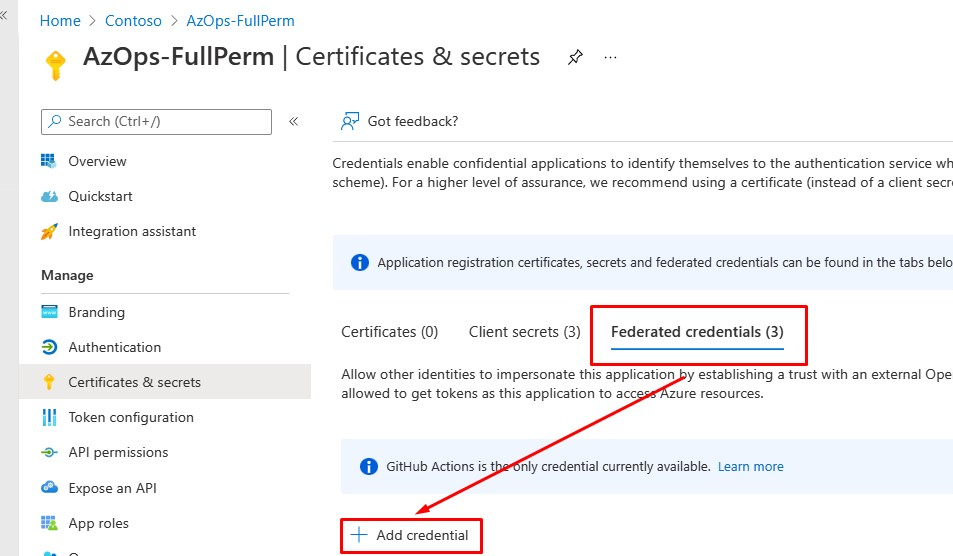
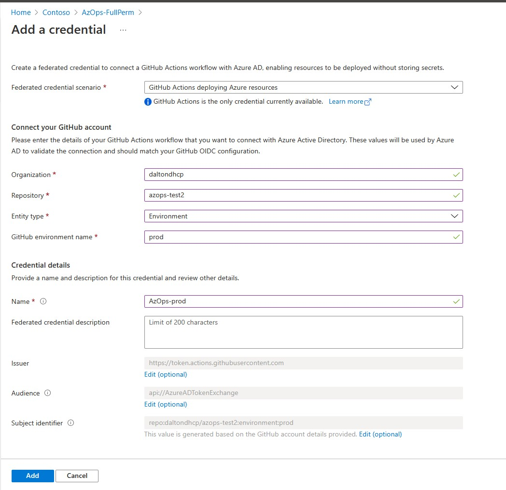
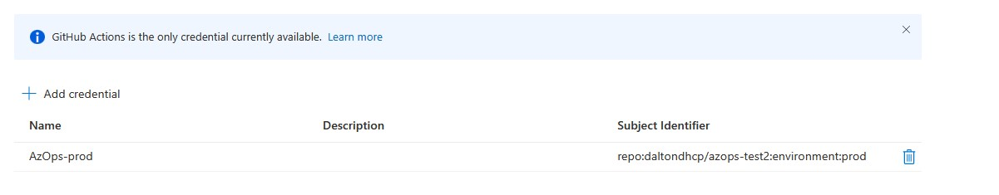
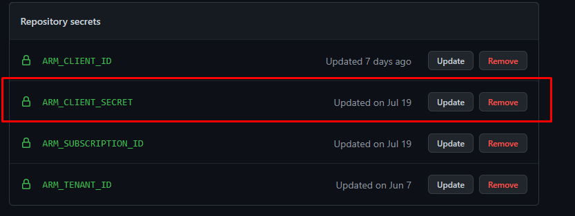

# Use Workload identity federation with the AzOps GitHub Actions

- [Introduction](#Introduction)
- [Configure](#Configure)
- [Resources](#Resources)

## Introduction

GitHub Actions now supports OpenID Connect (OIDC) for secure deployments to Azure, which uses short-lived tokens that are automatically rotated for each deployment. 
In the context of AzOps, this means we can allow the AzOps pipeline SPNs to access Azure Resource Manager and Azure AD with federated credentials, elimiating the need to create/handle secrets in the repository. 

This wiki explains how this feature can be configured and used in the AzOps GitHub Actions. 

> **Important**: To make this feature work with the current implementation of Workload identities, we take a dependency on [Environments for Github Actions](https://docs.github.com/en/actions/deployment/targeting-different-environments/using-environments-for-deployment). *Environments are only available in public repositories for free. Access to environments in private repositories requires [GitHub Enterprise](https://docs.github.com/en/get-started/learning-about-github/githubs-products#github-enterprise).*

## Configure
Before you start to configure the workload federation feature in Azure AD and changing the GitHub Actions, ensure that you have followed the instructions at https://github.com/azure/azops/wiki/prerequisites and have your service principal ready with appropriate RBAC permissions.

### Azure AD
1. In Azure AD, find your AzOps service principal and navigate to Certificates & Secrets -> Federated credentials. 
    
2. Add federated credentials to the Service Principal. Replace the values to reflect your organization, repository and environment name. In the accelerator examples, we have used 'prod' as the environment enable. 
    
    
### Github Actions 
> **Note:** If you don't want to update the pipelines manually, end-to-end sample pipelines with all required settings configured can be found [here](https://github.com/Azure/AzOps-Accelerator/tree/main/.github/samples/oidc-azuread). 
1. Add [permissions for the action](https://github.blog/changelog/2021-04-20-github-actions-control-permissions-for-github_token/) to be able to access the id-tokens and other relevant objects.
    ```yaml
    permissions:
        id-token: write
        contents: write
        pull-requests: write
    ```
2. Add the environment name to the job. 
    ```yaml
        environment: prod
    ```
3. Replace existing `Connect-AzAccount` with below steps. Currently, the OIDC integration requires Azure CLI beta. 
    ```yaml
      #
      # Connect
      # Authenticate Azure context
      #

      - name: OIDC Login to Azure Public Cloud with AzPowershell (enableAzPSSession true)
        uses: azure/login@v1
        with:
          client-id: ${{ env.ARM_CLIENT_ID}}
          tenant-id: ${{ env.ARM_TENANT_ID }}
          subscription-id: ${{ env.ARM_SUBSCRIPTION_ID }} 
          enable-AzPSSession: true
    ```
4. Test and validate Pull, Pull and Validate pipelines. 
5. After successful validation, all references to `ARM_CLIENT_SECRET` can be removed from the actions and the repository. 
    ```yaml
    ARM_CLIENT_SECRET: ${{ secrets.ARM_CLIENT_SECRET }}
    ```
    
## Resources
Read more about the functionality in the official docs below: 

* [Azure AD Workload identity federation](https://docs.microsoft.com/en-us/azure/active-directory/develop/workload-identity-federation)
* [GitHub Actions: Secure cloud deployments with OpenID Connect](https://github.blog/changelog/2021-10-27-github-actions-secure-cloud-deployments-with-openid-connect/)
