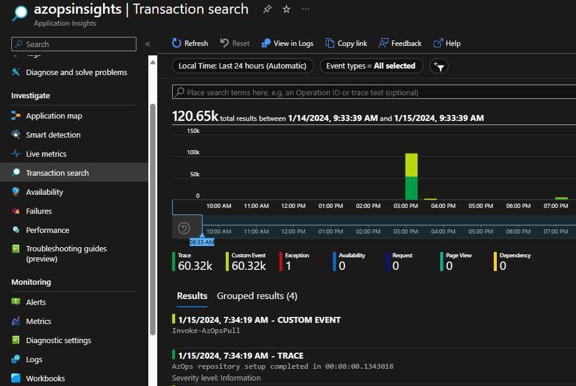
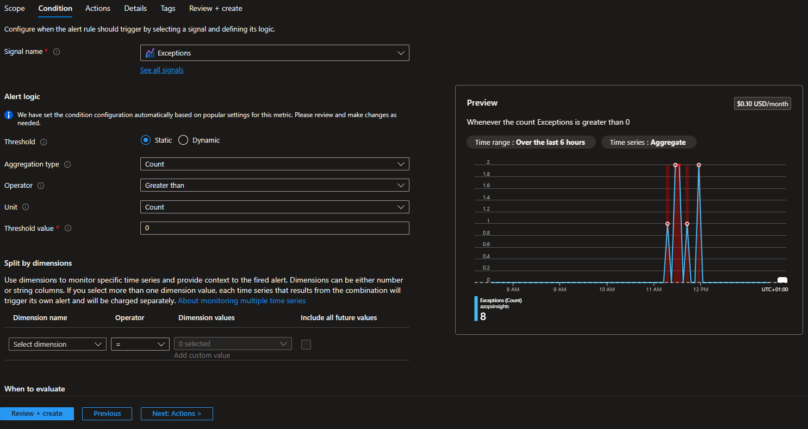
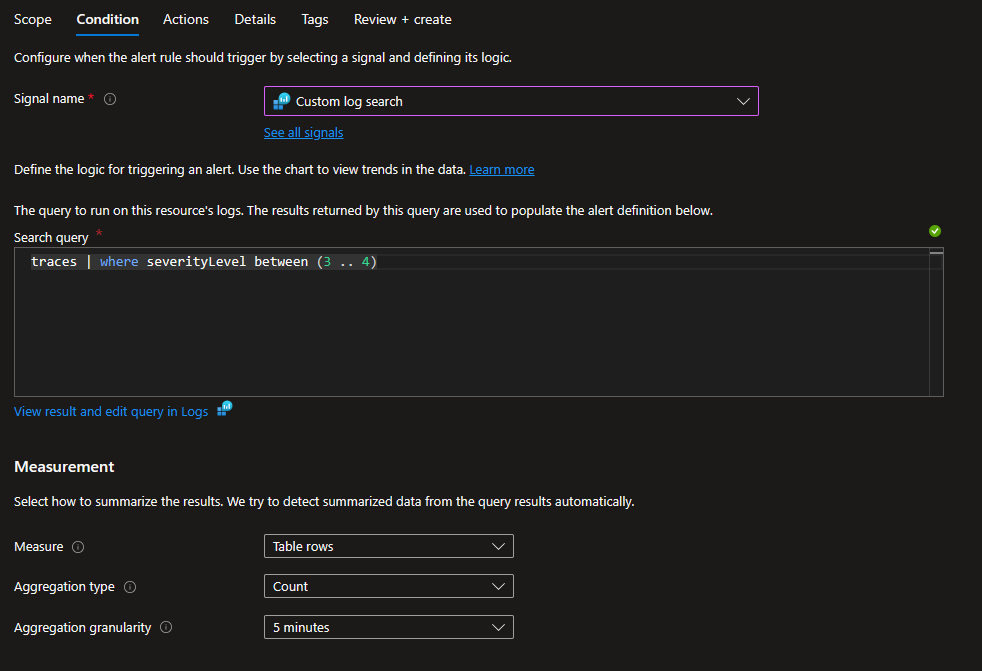

# In this Guide

- [Introduction](#introduction)
- [Troubleshooting AzOps](#troubleshooting-azops)
- [Operationalize monitoring and logging of AzOps](#operationalize-monitoring-and-logging-of-azops)
  - [Enable Application Insights Monitoring](#enable-application-insights-monitoring)
  - [Create Alert Rules](#create-alert-rules)

---

## Introduction

The AzOps module generates various logs and metrics to console during execution. The verbosity level is controlled by the numeric value of `Message.Info.Maximum` in `settings.json`. Lower values, like `1`, indicate minimal information, while `9` indicates the highest verbosity ([read more about the different levels](https://psframework.org/documentation/documents/psframework/logging/basics/message-levels.html)).

> **_Note:_** The default verbosity level is `3`, and increasing it may negatively affect runtime performance.

## Troubleshooting AzOps

During normal operations, the default verbosity level is sufficient. However, when troubleshooting, it is advisable to increase the verbosity to at least `5` or `8`. Going up to `9` makes the module very noisy ([read more](https://github.com/azure/azops/wiki/troubleshooting)).

## Operationalize monitoring and logging of AzOps

Monitoring and logging takes a leap forward with the capability for AzOps to seamlessly transmit logs to Azure Monitor Application Insights. This integration enhances near real-time visibility, analysis, and optimization, contributing to a more responsive and efficient Azure operational environment.



AzOps uses `TrackTrace` to create a "breadcrumb trail" in Application Insights. Warnings and errors are emitted as `TrackException` for diagnosis, and each message generates a `TrackEvent`. Metrics are emitted as `TrackMetric`, such as `AzOpsPush Time` and `AzOpsPull Time` in seconds.

> Note: This is useful for tracking performance, key metrics, and exceptions over time. It is particularly helpful when running the module with several parallel threads (`Core.ThrottleLimit` > `1`), as console output may not work well in parallel. Emitting information to Azure Monitor Application Insights can overcome this without adjusting `Core.ThrottleLimit`.

### Enable Application Insights Monitoring

1. [Create an Application Insights resource](https://learn.microsoft.com/en-us/azure/azure-monitor/app/create-workspace-resource#create-a-workspace-based-resource).
2. Add a secret named `APPLICATIONINSIGHTS_CONNECTIONSTRING` (in GitHub or Azure Pipelines) and enter the connection string for your Application Insights resource ([find your connection string](https://learn.microsoft.com/en-us/azure/azure-monitor/app/sdk-connection-string?tabs=dotnet5#find-your-connection-string)).

    > Note: Create the `APPLICATIONINSIGHTS_CONNECTIONSTRING` secret in the same location where you already have `ARM_TENANT_ID`. If you are using Azure Pipelines, remember to set the variable type to `secret`.
    >
    > Note: AzOps utilizes the connection string as a secret to authenticate. This requires that local authentication is enabled on the Application Insights resource (due to the high performance impact of Application Insights Microsoft Entra ID-based authentication).
    >
    > Note: AzOps emits each log event immediately as it happens to ensure messages are not lost. This means each event generates a service call to Application Insights that needs to be authenticated. No batching or schedule is used.

3. Set the `Core.ApplicationInsights` value in `settings.json` to `true`. AzOps will emit logs to both the console and the designated Azure Monitor Application Insights.

**_Please Note: For this to work with GitHub in the manner intended (applicable to implementations created prior to AzOps release v2.5.0)_**

Ensure the `Credentials` section is up-to-date and exists in your [pull.yml, push.yml, redeploy.yml, validate.yml](https://github.com/Azure/AzOps-Accelerator/blob/main/.github/workflows) files.

```bash
env:
  #
  # Credentials
  #

  APPLICATIONINSIGHTS_CONNECTIONSTRING: ${{ secrets.APPLICATIONINSIGHTS_CONNECTIONSTRING }}
```

### Create Alert Rules

Once monitoring is enabled, implement two essential alert rules using the powerful capabilities of [Azure Monitor alerts](https://learn.microsoft.com/en-us/azure/azure-monitor/alerts/alerts-overview).

1. [Create a metric alert rule](https://learn.microsoft.com/en-us/azure/azure-monitor/alerts/alerts-create-metric-alert-rule) with the condition based on the native `exceptions` signal.
   - Set a static threshold value of 0 to trigger the alert when the module logs any exception (**Warning, Error, Critical**).
   - Recommended alert detail severity: Warning.


2. [Create a log alert rule](https://learn.microsoft.com/en-us/azure/azure-monitor/alerts/alerts-create-metric-alert-rule) with the condition based on the native `Custom log search` signal.
   - Use the search query `traces | where severityLevel between (3 .. 4)` to trigger the alert for Error or Critical events.
   - Enhance the alert by splitting dimensions based on the dimension name `message` and ensure to check `include all future values`.
   - Recommended alert detail severity: Critical.
