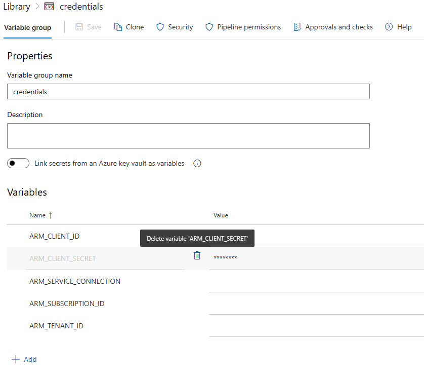

# Use Workload identity federation with the AzOps

- [Introduction](#introduction)
- [Configure](#configure)
    - [GitHub](#github)
    - [Azure DevOps](#pipelines)
- [Resources](#resources)

## Introduction

GitHub Actions and Azure Pipelines can make use of OpenID Connect (OIDC) for secure deployments to Azure, which uses short-lived tokens that are automatically rotated for each deployment.
In the context of AzOps, this means we can allow the AzOps pipeline Service Principal/User-assigned managed identity to access Azure Resource Manager and Azure AD with federated credentials, eliminating the need to create/handle secrets.

This wiki explains how this feature can be used and configured with AzOps.

## Configure

Before you start to configure the workload federation feature in Azure AD and changing the GitHub Actions or Azure DevOps Pipelines, ensure that you have followed the instructions at <https://github.com/azure/azops/wiki/prerequisites> and have your Service Principal/User-assigned managed identity ready with appropriate RBAC permissions.


### GitHub
> **Important**: For this feature to work with the current implementation of Workload identities, we take a dependency on [Environments for GitHub Actions](https://docs.github.com/en/actions/deployment/targeting-different-environments/using-environments-for-deployment). *Environments are only available in public repositories for free. Access to environments in private repositories requires [GitHub Enterprise](https://docs.github.com/en/get-started/learning-about-github/githubs-products#github-enterprise).*

How to setup GitHub Actions with workload identity federation:

- [Create a Microsoft Entra application and service principal](https://learn.microsoft.com/en-us/azure/developer/github/connect-from-azure?tabs=azure-portal%2Cwindows#create-a-microsoft-entra-application-and-service-principal)

- [Add federated credentials](https://learn.microsoft.com/en-us/azure/developer/github/connect-from-azure?tabs=azure-portal%2Cwindows#add-federated-credentials)

>
> **Note:** The starter GitHub pipelines in [AzOps-Accelerator](https://github.com/azure/azops-accelerator) have been updated to support federated credentials. Cconsider performing an update using the [update](https://github.com/azure/azops/wiki/updates) pipeline.

1. Validate that you have the latest version (post february 2023) of [sharedSteps/action.yml](https://github.com/Azure/AzOps-Accelerator/tree/main/.github/actions/sharedSteps), [pull.yml](https://github.com/Azure/AzOps-Accelerator/blob/main/.github/workflows/pull.yml), [push.yml](https://github.com/Azure/AzOps-Accelerator/blob/main/.github/workflows/push.yml), [redeploy.yml](https://github.com/Azure/AzOps-Accelerator/blob/main/.github/workflows/redeploy.yml) and [validate.yml](https://github.com/Azure/AzOps-Accelerator/blob/main/.github/workflows/validate.yml).
2. Uncomment the line with environment definition in [pull.yml](https://github.com/Azure/AzOps-Accelerator/blob/main/.github/workflows/pull.yml), [push.yml](https://github.com/Azure/AzOps-Accelerator/blob/main/.github/workflows/push.yml), [redeploy.yml](https://github.com/Azure/AzOps-Accelerator/blob/main/.github/workflows/redeploy.yml) and [validate.yml](https://github.com/Azure/AzOps-Accelerator/blob/main/.github/workflows/validate.yml). Change the environment name to reflect your environment names.

    ```yaml
        environment: prod # Environment if using Federated Credentials (https://github.com/azure/azops/wiki/oidc)
    ```

3. Remove all references to `ARM_CLIENT_SECRET` from the repository/environment secrets. If `ARM_CLIENT_SECRET` exists, the pipeline will try to connect with the secret instead.

    
4. Test the Pull, Push and Validate pipelines to ensure authentication works with federated credential.

### Pipelines

How to setup Azure DevOps Pipelines with workload identity federation:

- [Connect to Microsoft Azure with an ARM service connection](https://learn.microsoft.com/en-us/azure/devops/pipelines/library/connect-to-azure?view=azure-devops)

- [Manually configure Azure Resource Manager workload identity service connections](https://learn.microsoft.com/en-us/azure/devops/pipelines/release/configure-workload-identity?view=azure-devops)


>
> **Note:** The starter Azure Pipelines in [AzOps-Accelerator](https://github.com/azure/azops-accelerator) have been updated to support federated credentials. Consider performing an update using the [update](https://github.com/azure/azops/wiki/updates) pipeline.

1. Validate that you have the latest version (post october 2023) of [templates/sharedSteps.yml](https://github.com/Azure/AzOps-Accelerator/blob/main/.pipelines/.templates/sharedSteps.yml) and [templates/vars.yml](https://github.com/Azure/AzOps-Accelerator/blob/main/.pipelines/.templates/vars.yml).

3. Remove the `ARM_CLIENT_SECRET` variable from the `credentials` variable group. If `ARM_CLIENT_SECRET` exists, the pipeline will try to connect with the secret instead.

    
4. Test the Pull, Push and Validate pipelines to ensure authentication works with federated credential.

## Resources

Read more about the functionality in the official docs below:

- [Azure AD Workload identity federation](https://learn.microsoft.com/en-us/azure/active-directory/develop/workload-identity-federation)
- [GitHub Actions: Secure cloud deployments with OpenID Connect](https://github.blog/changelog/2021-10-27-github-actions-secure-cloud-deployments-with-openid-connect/)
- [Azure DevOps Pipelines: Workload Identity federation for Azure Deployments](https://learn.microsoft.com/en-us/azure/devops/release-notes/roadmap/2022/secret-free-deployments)
