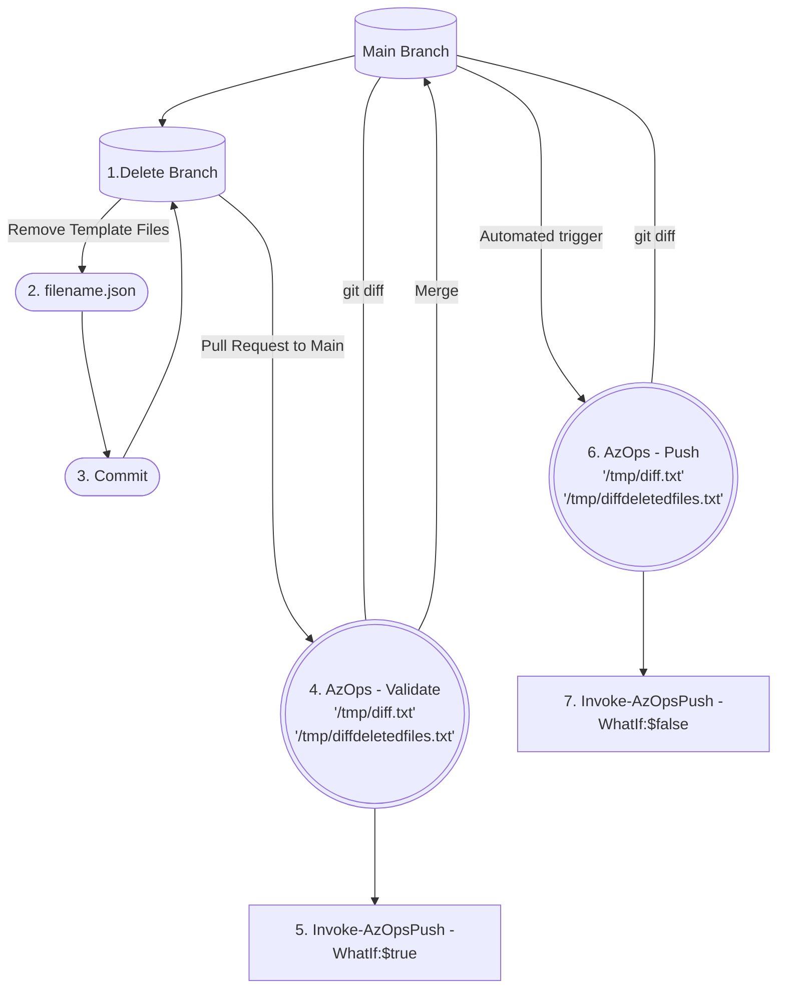
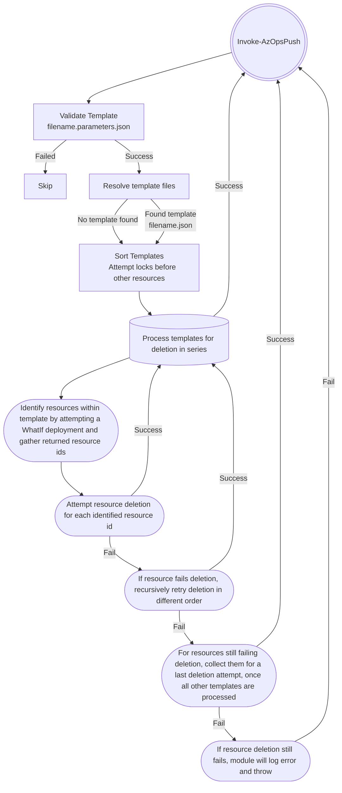

# AzOps Resource Deletion

- [Introduction](#introduction)
- [Deletion of AzOps generated File](#deletion-of-azops-generated-file)
  - [Deletion dependency validation](#deletion-dependency-validation)
  - [Deletion dependency validation scenario](#deletion-dependency-validation-scenario)
- [Deletion of Custom Template](#deletion-of-custom-template)
  - [Enable Deletion of Custom Template](#enable-deletion-of-custom-template)
- [Integration with AzOps Accelerator](#integration-with-azops-accelerator)
  - [How to Add AzOps Resource Deletion to existing AzOps Push](#how-to-add-azops-resource-deletion-to-existing-azops-push-and-validate-pipelines)

## Introduction

**AzOps Resource Deletion** at a high level enables two scenarios.
1. [Deletion of AzOps generated File](#deletion-of-azops-generated-file) of supported resource type, resulting in AzOps removes the corresponding resource in Azure.
2. [Deletion of Custom Template](#deletion-of-custom-template), resulting in AzOps removes the corresponding resource in Azure.



## Deletion of AzOps generated File

By removing a AzOps generated file of a supported resource type AzOps removes the corresponding resource in Azure.

_Supported resource types include: locks, policyAssignments, policyDefinitions, policyExemptions, policySetDefinitions, roleAssignments and resourceGroups in Azure._

- For any other `AzOps - Pull` generated resource **deletion** is **not** supported by AzOps at this time.

**_Please Note_**

- SPN used for deletion/change action, requires below actions in its role definition. Choose which combination best suites your implementation.

```bash
    Microsoft.Authorization/* OR  * (For everything)
```
- For Azure Locks removal

```bash
    Microsoft.Authorization/locks/delete
                            OR
    Microsoft.Authorization/locks/*
```

- For Azure Policy Assignment removal

```bash
    Microsoft.Authorization/policyAssignments/delete
                            OR
    Microsoft.Authorization/policyAssignments/*
```

- For Azure Policy Definition removal

```bash
    Microsoft.Authorization/policyDefinitions/delete
                            OR
    Microsoft.Authorization/policyDefinitions/*
```

- For Azure Policy Exemption removal

```bash
    Microsoft.Authorization/policyExemptions/delete
                            OR
    Microsoft.Authorization/policyExemptions/*
```

- For Azure Policy SetDefinition removal

```bash
    Microsoft.Authorization/policySetDefinitions/delete
                            OR
    Microsoft.Authorization/policySetDefinitions/*
```

- For Azure Role Assignment removal

```bash
    Microsoft.Authorization/roleAssignments/delete
                            OR
    Microsoft.Authorization/roleAssignments/*
```

- For Azure Resource group removal

```bash
    Microsoft.Resources/subscriptions/resourceGroups/delete
                            OR
    Microsoft.Resources/subscriptions/resourceGroups/*
```
### Deletion dependency validation
When deletion of a supported object is sent to AzOps it evaluates to ensure resource dependencies are included in the deletion job. If a dependency is missing the module will throw (exit with error) and post the result of missing dependencies to the pull request conversation asking you to add it and try again.

**_Please Note: For the validation pipeline to fail in the manner intended (applicable to implementations created prior to AzOps release v1.9.0)_**

Ensure the results job "if" logic exists in your [validate.yml](https://github.com/Azure/AzOps-Accelerator/blob/main/.pipelines/validate.yml)
```bash
- name: "Results"
    if: always()
    shell: bash
```
### Deletion dependency validation scenario
Scenario: Deletion of a policy definition and policy assignment where the assignment is referencing the policy definition.

- Create branch
  - Delete policy definition file from branch.
- Create pull request
  - Validation pipeline evaluates input and discovers there is a policy assignment with dependency towards the definition and the assignment is not part of the pull request.
  - Validation pipelines throws and posts results back to pull request conversation for user remediation.
- Two options:
  - a) In the branch delete the dependent file corresponding to the resulting error.
  - b) Delete the dependency in Azure and re-run validation.

## Deletion of Custom Template
Deletion of custom templates is a opt-in feature that you need to enable [see](#enable-deletion-of-custom-template).

Once enabled, deletion of `yourCustomTemplate.bicep`, `yourCustomTemplate.bicepparam`, `yourCustomTemplate.json` or `yourCustomTemplate.parameters.json` results in AzOps attempting deletion of the resolved Azure resources.

How does AzOps attempt deletion of custom template?



### Enable Deletion of Custom Template
Set the `Core.CustomTemplateResourceDeletion` value in `settings.json` to `true`.

`AzOps - Push` will now evaluate and attempt deletion of corresponding resource (_from template_) in Azure when a custom template is deleted.

## Integration with AzOps Accelerator

The [AzOps Accelerator pipelines](https://github.com/azure/azops-accelerator) (including `Git Hub Actions` & `Azure Pipelines`) incorporates the execution of resource deletion.

Conditional logic has been implemented to call `Invoke-AzOpsPush` with required change set in case of resource deletion operation, while existing logic without resource deletion remains same.


### How to Add AzOps Resource Deletion to existing AzOps Push and Validate pipelines

**_Applicable to implementations created prior to AzOps release v1.6.0_**

1. Update the `AzOps - Push` pipeline by copying content from the latest upstream [push.yml](https://github.com/Azure/AzOps-Accelerator/blob/main/.pipelines/push.yml) file into your existing file.
2. Update the `AzOps - Validate` pipeline by copying content from the latest upstream [validate.yml](https://github.com/Azure/AzOps-Accelerator/blob/main/.pipelines/validate.yml) file into your existing file.
