# AzOps Resources Deletion Feature

- [Introduction](#Introduction)
- [Supported Action](#Supported-Action)
- [How to use](#How-to-use)
- [Integration with AzOps Accelerator](#Integration-with-AzOps-Accelerator)


### Introduction

The purpose of this wiki is to provide you with the detail information about the **Resource Deletion** feature. The resource deletion function is an enhancement which takes care of deleting the role and policy assignments from Azure, based on the AzOps pull generated templates at all scopes.


### Supported Action

 - Deleting Custom or Built-in Role assignment: When `Invoke-AzOpsPull` runs, its fetches the existing environment which also includes custom and built-in role assignment. By removing the assignment file, role assignment at all levels `(Management Group/Subscription/Resource Group)` can be managed from repo directly.   

 - Deleting Custom or Built-in Azure Policy assignment: When `Invoke-AzOpsPull` runs, its fetches the existing environment which also includes custom and built-in  Azure Policy assignment. By removing the assignment file,  Azure Policy assignment at all levels `(Management Group/Subscription/Resource Group)` can be managed from repo directly. 


### How to use 

Below are the detail steps by following  which Resource deletion feature can be leveraged:-

1. Trigger the pull to fetch the fresh data of existing Azure environment. Navigate to Actions and run AzOps - Pull

    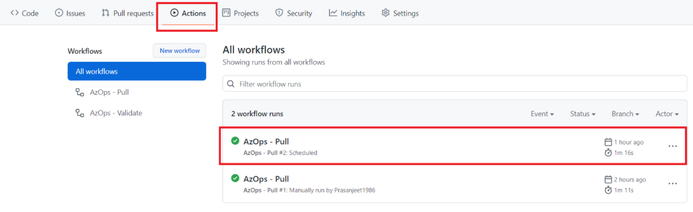  
    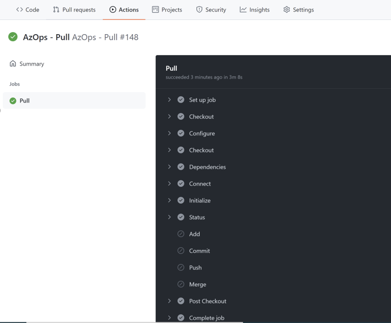

2. Its recommended to capture the current stage either from `portal` or via any `script` to validate the behavior after completion of the deletion.

    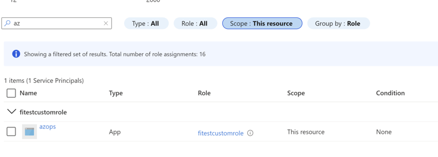
    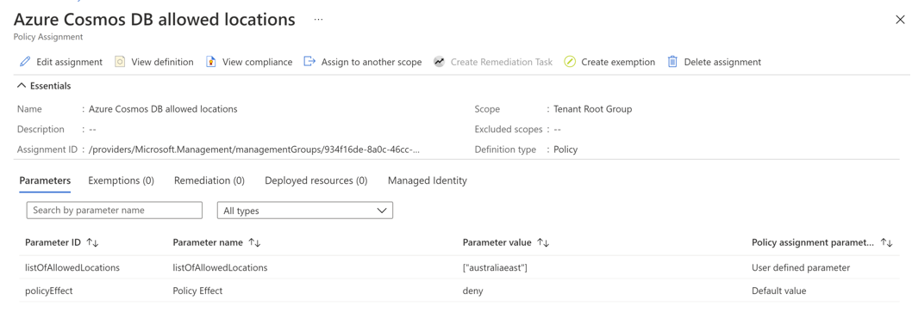

3.Browse to the repository and to the `feature branch` and delete the Role or Policy assignment file or both which are required to be deleted.

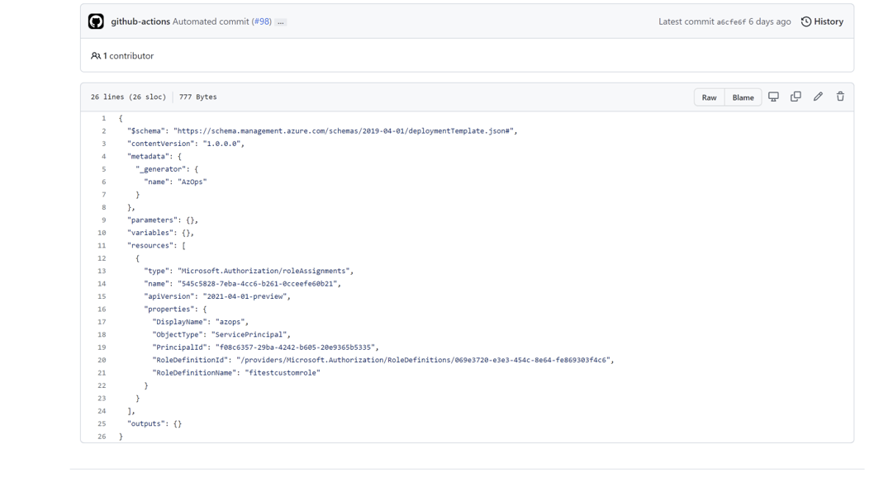
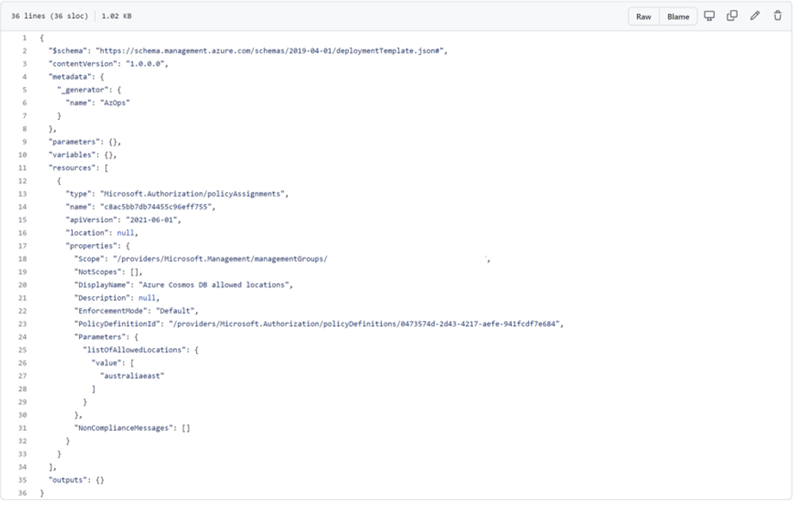

4. Once file has been deleted from the branch, create pull request from `Feature Branch` to `Master/Main Branch`.

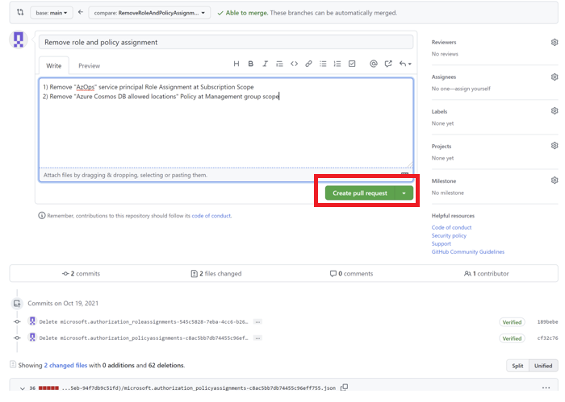
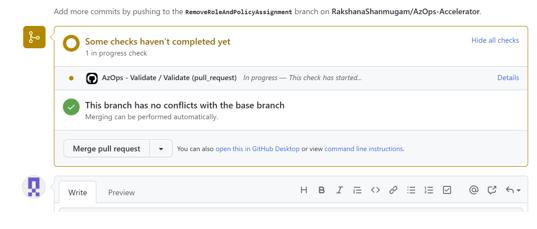

5. Once Pull Requested has been created, it will trigger the `AzOps - Validate` pipeline to do initial check. Wait for the pipeline to complete.

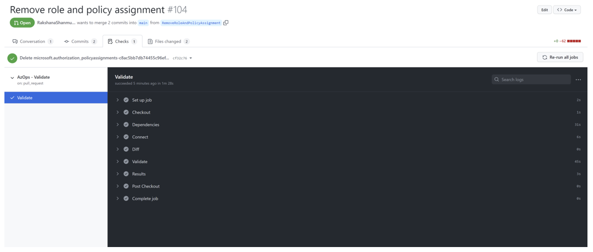

6. Now the `Approver` can review the pull request. It will have the detailed information about the file which are expected to be deleted and pull request can be approved based on that.

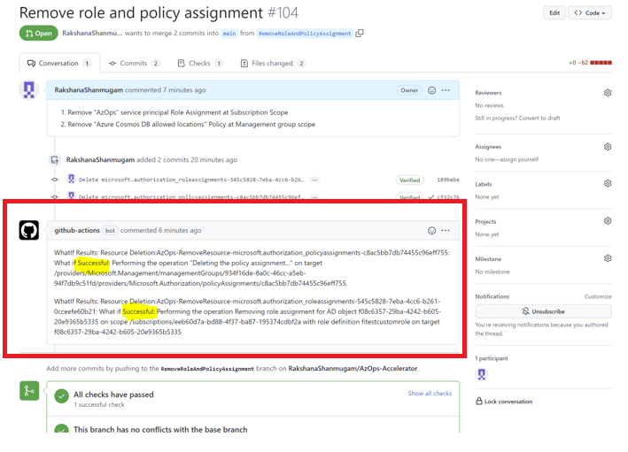
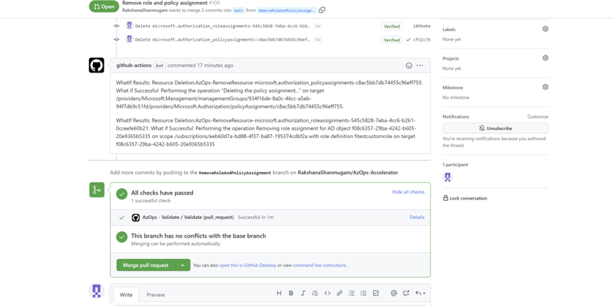

7. With the approval, `AzOps - Push` pipeline will get triggered to apply/implement the requested changes.

 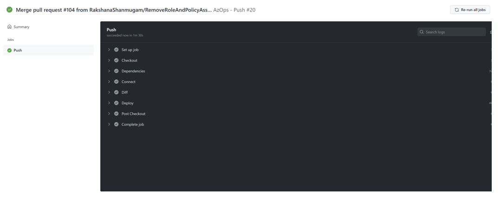

8. Now the changes can be validated via `Portal` or `Script`

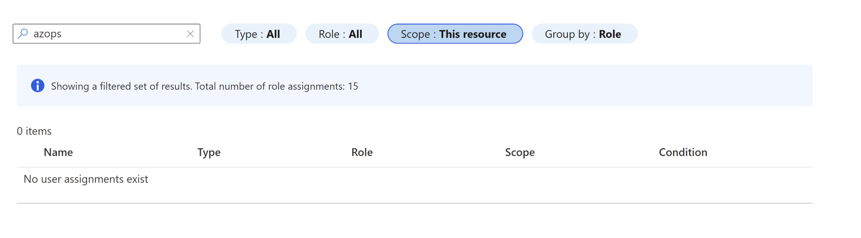
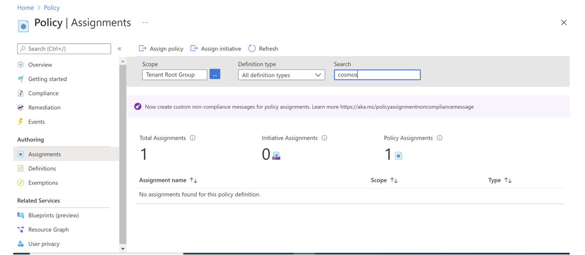


**_Please Note_**

- For any other resource type other than `Role assignment` or `Azure Policy assignment`, deletion is not supported in AzOps yet.
- Resource Deletion is only supported for templates generated by `AzOps - Pull`.
- Resource Deletion is also supported, If AutoGeneratedTemplateFolderPath setting is set to specific `FOLDER NAME` in `setting.json` file.
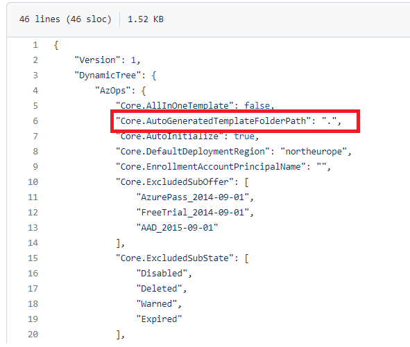
- SPN used for deletion/change action, should have the below scope in its role definition.
    
    - For Azure Policy assignment removal
    ```bash
                Microsoft.Authorization/policyAssignments/delete
                                        OR
                Microsoft.Authorization/policyAssignments/*
                                        OR
                Microsoft.Authorization/* OR  * (For everything)
    ```                
    - For Azure Role assignment removal
    ```bash
                Microsoft.Authorization/roleAssignments/delete
                                        OR
                Microsoft.Authorization/roleAssignments/*
                                        OR
                Microsoft.Authorization/* OR  * (For everything)
    ```                                                                                 

### Integration with AzOps Accelerator

The AzOps Accelerator pipelines (including `Git Hub Actions` & `Azure Pipelines`) have been updated to incorporate the execution of the new resource deletion feature.

Conditional logic has been implemented to call `Invoke-AzOpsPush` with required change set in case of resource deletion operation, while existing logic without resource deletion remains same.

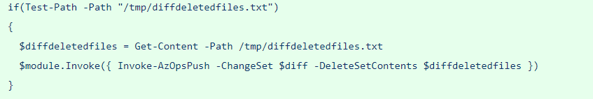