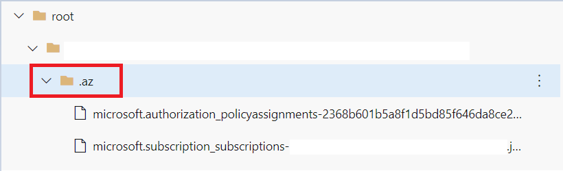

The following configuration values can be modified within the `settings.json` file to change the default behavior of AzOps.

| Id  | Name                                 | Description                                                                                                                                                                           | Example                                                                                         |
| --- | ------------------------------------ | ------------------------------------------------------------------------------------------------------------------------------------------------------------------------------------- | ----------------------------------------------------------------------------------------------- |
| 01  | AutoGeneratedTemplateFolderPath      | Generate sub folder for composite resources (/.Az)                                                                                                                                    |  |
| 02  | AutoInitialize                       | Run Initialize-AzOpsEnvironment when module is loaded. *Not recommended to change*                                                                                                    | `"Core.AutoInitialize": true`                                                                   |
| 03  | DefaultDeploymentRegion              | Default region for deployments                                                                                                                                                        | `"Core.DefaultDeploymentRegion": "northeurope"`                                                 |
| 04  | EnrollmentAccountPrincipalName       | Default enrollment account for Subscription creation                                                                                                                                  | `"Core.EnrollmentAccountPrincipalName": ""`                                                     |
| 05  | ExcludedSubOffer                     | Exclude specific Subscription offer types from pull                                                                                                                                   | `"Core.ExcludedSubOffer": [ "AzurePass_2014-09-01","FreeTrial_2014-09-01","AAD_2015-09-01"]`    |
| 06  | ExcludedSubState                     | Exclude specific states of Subscription from pull                                                                                                                                     | `"Core.ExcludedSubState": ["Disabled","Deleted","Warned","Expired"]`                            |
| 07  | ExportRawTemplate                    | Export generic templates without embedding them in the parameter block                                                                                                                | `"Core.ExportRawTemplate": true`                                                                |
| 08  | IgnoreContextCheck                   | Skip Azure PowerShell context validation. *Not recommended to change*                                                                                                                 | `"Core.IgnoreContextCheck": false`                                                              |
| 09  | InvalidateCache                      | Invalidate cached Subscriptions and Management Groups and do a full discovery. *Not recommended to change*                                                                            | `"Core.InvalidateCache": false`                                                                 |
| 10  | OfferType                            | Default offer type for Subscription creation                                                                                                                                          | `"Core.OfferType": "MS-AZR-0017P"`                                                              |
| 11  | PartialMgDiscoveryRoot               | Generate folder hierachy for specific Management Groups                                                                                                                               | `"Core.PartialMgDiscoveryRoot": []"`                                                            |
| 12  | SkipPolicy                           | Do not include Azure Policy state in pull                                                                                                                                             | `"Core.SkipPolicy": false`                                                                      |
| 13  | SkipResource                         | Do not include Resources within Resource Groups                                                                                                                                       | `"Core.SkipResource": false`                                                                    |
| 15  | SkipChildResourceDiscovery           | Do not include Azure child resources                                                                                                                                                  | `"Core.SkipChildResourceDiscovery": false`                                                      |
| 16  | SkipResourceGroup                    | Do not include Resource Groups in pull                                                                                                                                                | `"Core.SkipResourceGroup": false`                                                               |
| 17  | SkipResourceType                     | Skip specific [Resource Types](https://docs.microsoft.com/en-us/azure/azure-resource-manager/management/resource-providers-and-types)  (only targets Resource Group scoped resources) |
| 18  | SkipRole                             | Do not include Role types in pull                                                                                                                                                     | `"Core.SkipRole": false`                                                                        |
| 19  | State                                | Folder to store AzOpsState artefact, defaults to `root`                                                                                                                               |                                                            |
| 20  | SubscriptionsToIncludeResourceGroups | Filter which Subscriptions should include Resource Groups in pull                                                                                                                     | `"Core.SubscriptionsToIncludeResourceGroups": "*"`                                              |
| 21  | TemplateParameterFileSuffix          | Default template file suffix. *Not recommended to change*                                                                                                                             | `"Core.TemplateParameterFileSuffix": ".json"`                                                   |
| 22  | ThrottleLimit                        | Default template file suffix. *Not recommended to change*                                                                                                                             | `"Core.ThrottleLimit": 10`                                                                      |
| 23  | WhatifExcludedChangeTypes            | Exclude specific change types from WhatIf operations                                                                                                                                  | `"Core.WhatifExcludedChangeTypes": ["NoChange","Ignore"]`                                       |