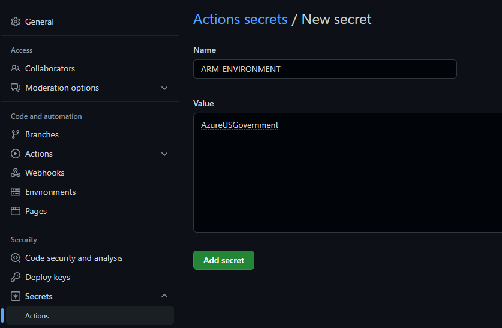
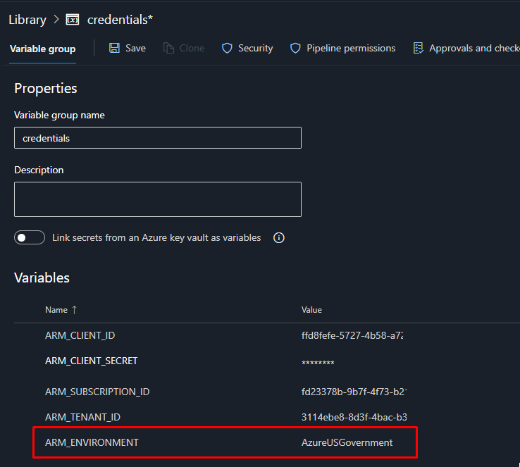

## Sovereign clouds
In addition to Public Azure Cloud that most of us are familiar with, there’s also separate sovereign Azure clouds for US Government and China.

To use AzOps with one of the sovereign clouds, the following additional configuration is required.

1) Create the `ARM_ENVIRONMENT` variable/secret with the sovereign cloud [environment name](https://docs.microsoft.com/en-us/powershell/module/az.accounts/get-azenvironment?view=azps-7.1.0#example-1--getting-all-azure-environments) as value, for example `AzureUSGovernment` or `AzureChinaCloud`.  
**GitHub Actions**

**Azure DevOps**

2) Update `"Core.DefaultDeploymentRegion"` in [settings.json](https://github.com/Azure/AzOps-Accelerator/blob/main/settings.json) to a supported region in the sovereign cloud, for example `usgovvirginia` for Azure US Government and `chinaeast2`for Azure China.
3) Run a pull to validate settings and populate the repository.